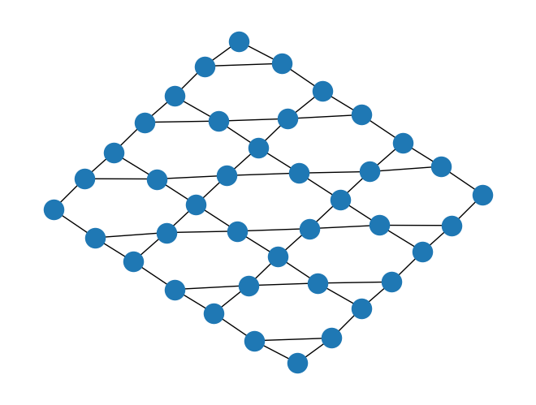
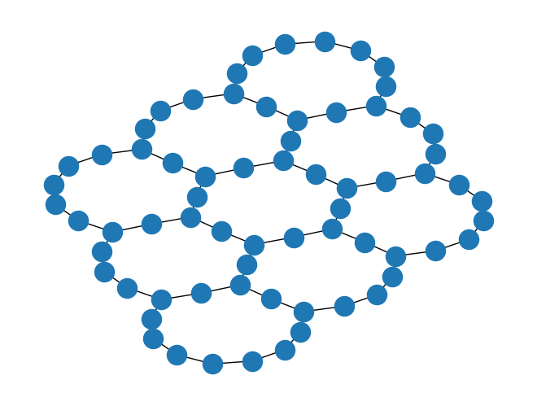
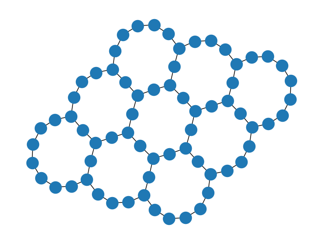

# Line-graph qubit routing: from kagome to heavy-hex and more
Joris Kattemölle and Seenivasan Hariharan
<hr/>

# Abstract

We showcase and benchmark line-graph qubit routing by routing random circuits (with fixed virtual graph) and circuits needed for the quantum simulation of the
Heisenberg antiferromagnet on various graphs. The code implementing line-routing itself is found in
`line_graph_routing.py` and maps Qiskit quantum circuits to Qiskit quantum circuits. (This can be altered to other circuit libraries with little effort.) We benchmark our results against other methods. The interactive version of this document is `line_graph_routing.ipynb`.

# Contents

1. Requirements
1. Kagome to heavy-hex
1. Complete graph to star graph
1. Shuriken to heavy-square-octagon
1. Checkerboard to heavy-square
1. Random line graph to random heavy graph
1. Benchmarking

# Requirements

This notebook should typically run after installing the following packages with pip (or conda). In a terminal,  run
```
pip install qiskit[visualization]
```
or 
```
pip install 'qiskit[visualization]'
```
and 
```
pip install netket networkx tabulate
```
Note Netket currently needs Python 3.9 (and SciPy $> = $ 1.9.3). Netket is only used to generate patches of the kagome lattice as graphs and not for line-graph routing itself. This notebook was tested with a pip environment that can be recreated with `requirements.txt` by running `pip install -r requirements.txt` (after creating a new environment).

The file `line_graph_routing.py` should be placed in the same folder as the current notebook. 


```python
import line_graph_routing as lgr
import networkx as nx
```

# Kagome to heavy-hex

## Random

Create a random circuit on a patch of the kagome lattice of $3\times 3$ unit cells and show the circuit's coupling graph. With probability 2/5, a CNOT is placed along an edge of the connectivity graph. With a probability 3/5 a gate from {H,S,T} is chosen uniformly at random and placed at a random node. 


```python
lg = lgr.kagome(3, 3)
qc = lgr.random_circuit(lg, 10**4)
cg = lgr.coupling_graph(qc)
nx.draw_kamada_kawai(cg)
print(qc.depth())
```

    725


    

    


Route the circuit to a circuit with heavy-hex coupling graph.


```python
qc = lgr.line_graph_route(qc)
cg = lgr.coupling_graph(qc)
nx.draw_kamada_kawai(cg)
print(qc.depth())
```

    1257


    

    


## Quantum simulation

We base our circuits on edge colorings of the (kagome) lattice by identifying every color with a layer of $\mathrm{HEIS}$ gates. One of the colors (color '0') doubles as a color specifying the initial state by indicating along which edges singlet states are placed. The entire circuit is repeated $p$ times,  excluding initial state preparation. Every $\mathrm{HEIS}$ gets its own parameter. These parameters can later be bound to specific values to obtain circuits for dynamical quantum simulation or for simulated adiabatic state preparation. 

First,  create and show an edge coloring of the kagome lattice.


```python
lg = lgr.edge_coloring(lg)
lgr.draw_edge_coloring(lg)
```

    Matching is perfect
    Edge coloring is not minimal


    

    


Create the associated circuit,  route it to heavy-hex hardware and show the coupling graph of the routed circuit.


```python
p = 1
qc = lgr.heis_circuit(lg, p)
print(qc.depth())
qc = lgr.line_graph_route(qc)
print(qc.depth())
cg = lgr.coupling_graph(qc)
nx.draw_kamada_kawai(cg)
```

    6
    15


    

    


Since the above circuit has the connectivity of a 2D graph, the corresponding quantum circuit diagram will not be very insightful. However, for a single unit cell of the kagome lattice, the routed quantum circuit becomes a circuit on a circle, which allows for a clear representation as a quantum circuit diagram. We first create an edge coloring of the unit cell patch. 


```python
lg = lgr.kagome(1, 1)
lg = lgr.edge_coloring(lg)
lgr.draw_edge_coloring(lg)
```

    Matching is perfect
    Edge coloring is not minimal


    

    


Create the HEIS circuit ased on this coloring, map it to heavy-hex hardware, and show the coupling graph of the routed circuit. 


```python
p = 1
qc = lgr.heis_circuit(lg, p)
print(qc.depth())
qc = lgr.line_graph_route(qc)
print(qc.depth())
cg = lgr.coupling_graph(qc)
nx.draw_kamada_kawai(cg, with_labels = 'true')
```

    4
    7


    

    


Show the circuit diagram of the routed circuit, with parameters `al_i`.


```python
wo = [0, 3, 1, 10, 7, 11, 4, 2, 5, 8, 6, 9] # In the circuit diagram, place qubits in this order.
qc.draw('latex', wire_order = wo)
```


    

    


The fircuit depth can be reduced further by replacement of the initial and final SWAP gates between qubits (10,7) and (8,6) by a relabeling of those qubits. 

# Complete graph to star graph

## Random

Create a random circuit on the complete graph of four nodes and show the circuit's coupling graph.


```python
n = 5
lg = nx.complete_graph(4)
qc = lgr.random_circuit(lg, 10**2)
cg = lgr.coupling_graph(qc)
nx.draw_kamada_kawai(cg)
print(qc.depth())
```

    55


    

    


Route the circuit to a circuit with star-graph connectivity. 


```python
qc = lgr.line_graph_route(qc)
cg = lgr.coupling_graph(qc)
nx.draw_kamada_kawai(cg)
print(qc.depth())
```

    105


    

    


## Quantum simulation

As before,  circuits are defined by identifying every color with a layer of $\mathrm{HEIS}$-gates. For more details,  see the `kagome to heavy-hex` section.

Create and show an edge coloring of the complete graph.


```python
lg = lgr.edge_coloring(lg)
lgr.draw_edge_coloring(lg)
```

    Matching is perfect
    Edge coloring is not minimal


    

    


Create the associated circuit,  route it to heavy-hex hardware,  and show the coupling graph of the routed circuit.


```python
p = 1
qc = lgr.heis_circuit(lg, p)
print(qc.depth())
qc = lgr.line_graph_route(qc)
print(qc.depth())
cg = lgr.coupling_graph(qc)
nx.draw_kamada_kawai(cg)
```

    4
    20


    

    


We do not show the circuit diagram in this case because the routed circuit is not a circuit on a line.

# Shuriken to heavy square-octagon

## Random

Create a random circuit on a patch of the shuriken lattice of $3\times 3$ unit cells.


```python
n = 5
lg = lgr.shuriken(3, 3)
qc = lgr.random_circuit(lg, 10**4)
cg = lgr.coupling_graph(qc)
nx.draw_kamada_kawai(cg)
print(qc.depth())
```

    508


    

    


Route the circuit to a circuit with heavy-square-octagon connectivity.


```python
qc = lgr.line_graph_route(qc)
cg = lgr.coupling_graph(qc)
nx.draw_kamada_kawai(cg)
print(qc.depth())
```

    879


    

    


## Quantum simulation

As before,  circuits are defined by identifying every color with a layer of $\mathrm{HEIS}$-gates. For more details,  see the `kagome to heavy-hex` section.

Create and show an edge coloring of the shuriken lattice.


```python
lg  =  lgr.edge_coloring(lg)
lgr.draw_edge_coloring(lg)
```

    Matching is perfect
    Edge coloring is not minimal


    

    


Create the associated circuit,  route it to heavy-square-octagon hardware,  and show the coupling graph of the routed circuit.


```python
p = 1
qc = lgr.heis_circuit(lg, p)
print(qc.depth())
qc = lgr.line_graph_route(qc)
print(qc.depth())
cg = lgr.coupling_graph(qc)
nx.draw_kamada_kawai(cg)
```

    6
    12


    

    


Again, the resulting circuit diagram will not be very insightful, but it will be for a single-unit cell patch of the shuriken lattice. 


```python
lg = lgr.shuriken(1, 1)
lg = lgr.edge_coloring(lg)
lgr.draw_edge_coloring(lg)
```

    Matching is perfect
    Edge coloring is minimal


    

    


```python
p = 1
qc = lgr.heis_circuit(lg, p)
print(qc.depth())
qc = lgr.line_graph_route(qc)
print(qc.depth())
cg = lgr.coupling_graph(qc)
nx.draw_kamada_kawai(cg, with_labels = 'true')
```

    5
    9


    

    


```python
qc.draw('latex')
```


    

    


# Checkerboard to heavy-square


```python
m = 2.5 # For the checkerboard lattice, specify dimentions in nodes by nodes.
lg = lgr.checkerboard(m, m)
qc = lgr.random_circuit(lg, 10**4)
cg = lgr.coupling_graph(qc)
nx.draw_kamada_kawai(cg)
print(qc.depth())
```

    901


    

    


Route the circuit to a circuit with a heavy-square coupling graph.


```python
qc = lgr.line_graph_route(qc)
cg = lgr.coupling_graph(qc)
nx.draw_kamada_kawai(cg)
print(qc.depth())
```

    1713


    

    


## Quantum simulation

As before,  circuits are defined by identifying every color with a layer of $\mathrm{HEIS}$-gates. For more details,  see the `kagome to heavy-hex` section.

Create and show an edge coloring of the checkerboard lattice


```python
lg  =  lgr.edge_coloring(lg)
lgr.draw_edge_coloring(lg, spectral=True) # Use spactral method to find location of nodes.
```

    Matching is perfect
    Edge coloring is not minimal


    

    


Create the associated circuit,  route it to heavy-square-octagon hardware,  and show the coupling graph of the routed circuit.


```python
p = 1
qc = lgr.heis_circuit(lg, p)
print(qc.depth())
qc = lgr.line_graph_route(qc)
print(qc.depth())
cg = lgr.coupling_graph(qc)
nx.draw_kamada_kawai(cg)
```

    8
    33


    

    


# Random line graph to random heavy graph

## Random

Create a random circuit on a random graph with 6 nodes and show the circuit's coupling graph. For details on `radom_line_graph` generation,  see its function definition in `line_graph_routing.py`. 


```python
n = 6
lg = lgr.random_line_graph(6)
qc = lgr.random_circuit(lg, 10**3)
cg = lgr.coupling_graph(qc)
nx.draw_kamada_kawai(cg)
print(qc.depth())
```

    264


    

    


Route the circuit to a circuit with the associated heavy connectivity. 


```python
qc = lgr.line_graph_route(qc)
cg = lgr.coupling_graph(qc)
nx.draw_kamada_kawai(cg)
print(qc.depth())
```

    503


    

    


## Quantum simulation

As before,  circuits are defined by identifying every color with a layer of $\mathrm{HEIS}$-gates. For more details,  see the `kagome to heavy-hex` section.

Create and show an edge coloring of random graph. The method we use to find a perfect matching (needed for initial state preparation) is limited and may not find a perfect matching even if it exists. If a perfect matching is not found,  try to create another random line graph (i.e.,  evaluate the two cells above) or use more sophisticated (or brute-force) methods to find a perfect matching. 


```python
lg = lgr.edge_coloring(lg)
lgr.draw_edge_coloring(lg)
```

    Matching is perfect
    Edge coloring is not minimal


    

    


Create the associated circuit,  route it to heavy-hex hardware and show the coupling graph of the routed circuit.


```python
p = 1
qc = lgr.heis_circuit(lg, p)
print(qc.depth())
qc = lgr.line_graph_route(qc)
print(qc.depth())
cg = lgr.coupling_graph(qc)
nx.draw_kamada_kawai(cg)
```

    8
    33


    

    


We do not show the circuit diagram in this case because the routed circuit is not a circuit on a line.

# Benchmarking

We benchmark line graph routing by performing the above routing tasks (but for larger unit cells) using both line-graph qubit routing and all methods available in qiskit. These methods are 'basic', 'lookahead', 'stochastic', and 'sabre' [1]. 

The benchmarking settings are specified by the following options:
- `name` The name of the virtual graph, either `kagome`, `shuriken` or `complete`.
- `size`. In case of `kagome` and `shuriken`: the size of the patch in unit cells by unit cells. In case of `complete`: the number of nodes of the complete graph.
- `circuit type`. Either `quantum simulation` or `random`, as presented in this notebook. 
- `p` In case of `kagome` and `shuriken`: the number of cycles of the circuit. In case of `complete`: the number of random gates from the set `H,T,S,CNOT`. 
- `repetitions`. The number of runs for the methods `sabre` and `stochastic`. The methods `line-graph` and `basic` are deterministic and hence only run once. Correspondingly, the reported `total time` pertains to the time taken for this single run in case of the latter two methods. 
- `optimization_level`. Either 0, 1, 2, or 3.  This specifies optimization level used for the routing methods implemented in qiskit [2]. This parameter is passed directly to Qiskit's transpiler [1]. 
- `methods`. The methods to benchmark line graph transpilation against. Must be a list containing elements from `['sabre','basic','lookahead',stochastic]`. These methods are passed directly to Qiskit's transpiler [1]. 

The methods `sabre` and `stochastic` are probabilistic, achieving a different routing each time they are run, and hence achieve different performance characteristics with each run. We therefore run these methods $repetitions$ times and report the average, confidence interval, and best performance out of these runs. Error bars on the data show the (symmetrized) 95% confidence interval and are obtained by bootstrapping the data. The error interval for `num_qubits` is sometimes given by `nan` because in those cases the number of qubits was equal for all runs. The routing methods`line-graph` and `basic` are deterministic and for these we enforce `repetitions=1`. 

We consider the following performance characteristics.
- `method` The routing method.
- `av. n_swaps` The average number of swaps obtained among the `repetitions` runs of the routing method.
- `min n_swap` The number of swaps of the run that achieved the lowest depth.
- `av. depth` The average depth of the routed circuits among the `repetitions` runs of the routing method. We focus on the performance of routing so none of the gates in any of the routing methods are compiled into hardware native gates. That is, for the purposes of assessing routing performance, we assume the gate set `SWAP`, `HEIS`, `H`, `X`, `Z`  `CNOT` for the quantum simulation circuits. For the random circuits we assume `SWAP`, `CNOT`, `H`, `S`, `T`.
- `min depth` The minimum depth among the `repetitions` runs of the routing method.
- `av. n_qubits` The average number obtained among the `repetitions` runs of the routing method. 
- `total time` The total wall clock time (in seconds) needed to perform all `repetitions` runs of the routing method. 
- `av. time` The average (minimum) wall clock time of the `repetitions` routing runs. 
- `min. time` The number wall clock run time of the run that achieved the lowest depth.

[1] Qiskit 0.43.0 documentation, https://qiskit.org/documentation/stubs/qiskit.compiler.transpile.html, accessed 11h May 2023.
[2] https://github.com/Qiskit/qiskit-terra/tree/main/qiskit/transpiler/preset_passmanagers

### Quantum simulation, kagome and shuriken, agianst SABRE


```python
import line_graph_routing as lgr # Loading these makes these cells stand-alone
import pickle

settings=[]
for name in ['kagome','shuriken']:
    for side in range(1,9,2):
        for p in [1,8,16]:
            for optimization_level in range(4):
                setting={'name':name,
                     'size': (side,side),
                     'circuit_type': 'quantum_simulation',
                     'p': p,
                     'repetitions' : 16,
                     'optimization_level' : optimization_level,
                     'methods' : ['sabre']
                    }
                settings.append(setting)
                                
## Uncomment to rerun benchmarks. This takes a couple of hours.
#results=[]
#for setting in settings:
#    result=lgr.benchmark(**setting)
#    results.append(result)
#    lgr.print_benchmark(result)
#
#with open('benchmark_data/kagome_shuriken.pkl','wb') as f:
#    pickle.dump(results,f)

#Load previously obtained results from disk and show them. 
import pickle
with open('benchmark_data/kagome_shuriken.pkl','rb') as f:
    results=pickle.load(f)

for result in results:
    lgr.print_benchmark(result)
```

    {\tiny
    ------------------------------------------------------------------------------------------------------------------------------------------------------
    name = kagome, size = (1, 1), circuit_type = quantum_simulation, p = 1, repetitions = 16, optimization_level = 0
    
    method      av. n_swaps      min. n_swap  av. depth       min. depth  av. n_qubits      min. qubits    total time (s)  av. time (s)      min. time (s)
    ----------  -------------  -------------  ------------  ------------  --------------  -------------  ----------------  --------------  ---------------
    line-graph  12 ± 0.0                  12  7 ± 0.0                  7  12 ± 0.0                   12              0.08  0.08 ± 0.0                 0.08
    sabre       16 ± 2.06                  6  12.38 ± 2.09             6  10.25 ± 1.0                12              0.7   0.04 ± 0.06                0.02
    ------------------------------------------------------------------------------------------------------------------------------------------------------
    }
    
    {\tiny
    ------------------------------------------------------------------------------------------------------------------------------------------------------
    name = kagome, size = (1, 1), circuit_type = quantum_simulation, p = 1, repetitions = 16, optimization_level = 1
    
    method      av. n_swaps      min. n_swap  av. depth      min. depth  av. n_qubits      min. qubits    total time (s)  av. time (s)      min. time (s)
    ----------  -------------  -------------  -----------  ------------  --------------  -------------  ----------------  --------------  ---------------
    line-graph  12 ± 0.0                  12  7 ± 0.0                 7  12 ± 0.0                   12              0.08  0.08 ± 0.0                 0.08
    sabre       10 ± 0.81                  6  6.44 ± 0.34             6  8.75 ± 0.75                 8              0.32  0.02 ± nan                 0.02
    ------------------------------------------------------------------------------------------------------------------------------------------------------
    }
    
    {\tiny
    ------------------------------------------------------------------------------------------------------------------------------------------------------
    name = kagome, size = (1, 1), circuit_type = quantum_simulation, p = 1, repetitions = 16, optimization_level = 2
    
    method      av. n_swaps      min. n_swap  av. depth      min. depth  av. n_qubits      min. qubits    total time (s)  av. time (s)      min. time (s)
    ----------  -------------  -------------  -----------  ------------  --------------  -------------  ----------------  --------------  ---------------
    line-graph  12 ± 0.0                  12  7 ± 0.0                 7  12 ± 0.0                   12              0.08  0.08 ± 0.0                 0.08
    sabre       6 ± nan                    6  6.0 ± nan               6  8.0 ± nan                   8              0.33  0.02 ± 0.0                 0.02
    ------------------------------------------------------------------------------------------------------------------------------------------------------
    }
    
    {\tiny
    ------------------------------------------------------------------------------------------------------------------------------------------------------
    name = kagome, size = (1, 1), circuit_type = quantum_simulation, p = 1, repetitions = 16, optimization_level = 3
    
    method      av. n_swaps      min. n_swap  av. depth      min. depth  av. n_qubits      min. qubits    total time (s)  av. time (s)      min. time (s)
    ----------  -------------  -------------  -----------  ------------  --------------  -------------  ----------------  --------------  ---------------
    line-graph  12 ± 0.0                  12  7 ± 0.0                 7  12 ± 0.0                   12              0.08  0.08 ± 0.0                 0.08
    sabre       6 ± nan                    6  6.0 ± nan               6  8.0 ± nan                   8              0.75  0.05 ± 0.02                0.04
    ------------------------------------------------------------------------------------------------------------------------------------------------------
    }
    
    {\tiny
    ------------------------------------------------------------------------------------------------------------------------------------------------------
    name = kagome, size = (1, 1), circuit_type = quantum_simulation, p = 8, repetitions = 16, optimization_level = 0
    
    method      av. n_swaps      min. n_swap  av. depth       min. depth  av. n_qubits      min. qubits    total time (s)  av. time (s)      min. time (s)
    ----------  -------------  -------------  ------------  ------------  --------------  -------------  ----------------  --------------  ---------------
    line-graph  96 ± 0.0                  96  49 ± 0.0                49  12 ± 0.0                   12              0.67  0.67 ± 0.0                 0.67
    sabre       99 ± 7.66                 48  52.94 ± 5.28            41  11.5 ± 0.75                12              1.39  0.09 ± 0.02                0.08
    ------------------------------------------------------------------------------------------------------------------------------------------------------
    }
    
    {\tiny
    ------------------------------------------------------------------------------------------------------------------------------------------------------
    name = kagome, size = (1, 1), circuit_type = quantum_simulation, p = 8, repetitions = 16, optimization_level = 1
    
    method      av. n_swaps      min. n_swap  av. depth       min. depth  av. n_qubits      min. qubits    total time (s)  av. time (s)      min. time (s)
    ----------  -------------  -------------  ------------  ------------  --------------  -------------  ----------------  --------------  ---------------
    line-graph  96 ± 0.0                  96  49 ± 0.0                49  12 ± 0.0                   12              0.64  0.64 ± 0.0                 0.64
    sabre       48 ± 8.62                 48  42.88 ± 3.28            41  8.5 ± 0.75                  8              1.67  0.1 ± 0.02                 0.09
    ------------------------------------------------------------------------------------------------------------------------------------------------------
    }
    
    {\tiny
    ------------------------------------------------------------------------------------------------------------------------------------------------------
    name = kagome, size = (1, 1), circuit_type = quantum_simulation, p = 8, repetitions = 16, optimization_level = 2
    
    method      av. n_swaps      min. n_swap  av. depth       min. depth  av. n_qubits      min. qubits    total time (s)  av. time (s)      min. time (s)
    ----------  -------------  -------------  ------------  ------------  --------------  -------------  ----------------  --------------  ---------------
    line-graph  96 ± 0.0                  96  49 ± 0.0                49  12 ± 0.0                   12              0.64  0.64 ± 0.0                 0.64
    sabre       48 ± 7.19                 48  41.56 ± 1.41            41  8.25 ± 0.62                 8              2.07  0.13 ± 0.02                0.11
    ------------------------------------------------------------------------------------------------------------------------------------------------------
    }
    
    {\tiny
    ------------------------------------------------------------------------------------------------------------------------------------------------------
    name = kagome, size = (1, 1), circuit_type = quantum_simulation, p = 8, repetitions = 16, optimization_level = 3
    
    method      av. n_swaps      min. n_swap  av. depth      min. depth  av. n_qubits      min. qubits    total time (s)  av. time (s)      min. time (s)
    ----------  -------------  -------------  -----------  ------------  --------------  -------------  ----------------  --------------  ---------------
    line-graph  96 ± 0.0                  96  49 ± 0.0               49  12 ± 0.0                   12              0.64  0.64 ± 0.0                 0.64
    sabre       48 ± nan                  48  41.0 ± nan             41  8.0 ± nan                   8              5.07  0.32 ± 0.02                0.29
    ------------------------------------------------------------------------------------------------------------------------------------------------------
    }
    
    {\tiny
    ------------------------------------------------------------------------------------------------------------------------------------------------------
    name = kagome, size = (1, 1), circuit_type = quantum_simulation, p = 16, repetitions = 16, optimization_level = 0
    
    method      av. n_swaps      min. n_swap  av. depth       min. depth  av. n_qubits      min. qubits    total time (s)  av. time (s)      min. time (s)
    ----------  -------------  -------------  ------------  ------------  --------------  -------------  ----------------  --------------  ---------------
    line-graph  192 ± 0.0                192  97 ± 0.0                97  12 ± 0.0                   12              1.29  1.29 ± 0.0                 1.29
    sabre       100 ± 18.19               96  99.38 ± 9.69            81  11.25 ± 0.75               12              2.78  0.17 ± 0.02                0.15
    ------------------------------------------------------------------------------------------------------------------------------------------------------
    }
    
    {\tiny
    ------------------------------------------------------------------------------------------------------------------------------------------------------
    name = kagome, size = (1, 1), circuit_type = quantum_simulation, p = 16, repetitions = 16, optimization_level = 1
    
    method      av. n_swaps      min. n_swap  av. depth       min. depth  av. n_qubits      min. qubits    total time (s)  av. time (s)      min. time (s)
    ----------  -------------  -------------  ------------  ------------  --------------  -------------  ----------------  --------------  ---------------
    line-graph  192 ± 0.0                192  97 ± 0.0                97  12 ± 0.0                   12              1.31  1.31 ± 0.0                 1.31
    sabre       96 ± 17.62                96  86.69 ± 8.53            81  8.5 ± 0.75                  8              3.18  0.2 ± 0.03                 0.17
    ------------------------------------------------------------------------------------------------------------------------------------------------------
    }
    
    {\tiny
    ------------------------------------------------------------------------------------------------------------------------------------------------------
    name = kagome, size = (1, 1), circuit_type = quantum_simulation, p = 16, repetitions = 16, optimization_level = 2
    
    method      av. n_swaps      min. n_swap  av. depth      min. depth  av. n_qubits      min. qubits    total time (s)  av. time (s)      min. time (s)
    ----------  -------------  -------------  -----------  ------------  --------------  -------------  ----------------  --------------  ---------------
    line-graph  192 ± 0.0                192  97 ± 0.0               97  12 ± 0.0                   12              1.3   1.3 ± 0.0                  1.3
    sabre       96 ± nan                  96  81.0 ± nan             81  8.0 ± nan                   8              3.74  0.23 ± 0.02                0.21
    ------------------------------------------------------------------------------------------------------------------------------------------------------
    }
    
    {\tiny
    ------------------------------------------------------------------------------------------------------------------------------------------------------
    name = kagome, size = (1, 1), circuit_type = quantum_simulation, p = 16, repetitions = 16, optimization_level = 3
    
    method      av. n_swaps      min. n_swap  av. depth      min. depth  av. n_qubits      min. qubits    total time (s)  av. time (s)      min. time (s)
    ----------  -------------  -------------  -----------  ------------  --------------  -------------  ----------------  --------------  ---------------
    line-graph  192 ± 0.0                192  97 ± 0.0               97  12 ± 0.0                   12              1.29  1.29 ± 0.0                 1.29
    sabre       96 ± nan                  96  81.0 ± nan             81  8.0 ± nan                   8             10.26  0.64 ± 0.02                0.67
    ------------------------------------------------------------------------------------------------------------------------------------------------------
    }
    
    {\tiny
    ------------------------------------------------------------------------------------------------------------------------------------------------------
    name = kagome, size = (3, 3), circuit_type = quantum_simulation, p = 1, repetitions = 16, optimization_level = 0
    
    method      av. n_swaps      min. n_swap  av. depth      min. depth  av. n_qubits      min. qubits    total time (s)  av. time (s)      min. time (s)
    ----------  -------------  -------------  -----------  ------------  --------------  -------------  ----------------  --------------  ---------------
    line-graph  112 ± 0.0                112  15 ± 0.0               15  68 ± 0.0                   68              0.6   0.6 ± 0.0                  0.6
    sabre       307 ± 3.44               286  72.62 ± 3.5            63  55.0 ± 1.66                55              1.83  0.11 ± 0.02                0.09
    ------------------------------------------------------------------------------------------------------------------------------------------------------
    }
    
    {\tiny
    ------------------------------------------------------------------------------------------------------------------------------------------------------
    name = kagome, size = (3, 3), circuit_type = quantum_simulation, p = 1, repetitions = 16, optimization_level = 1
    
    method      av. n_swaps      min. n_swap  av. depth       min. depth  av. n_qubits      min. qubits    total time (s)  av. time (s)      min. time (s)
    ----------  -------------  -------------  ------------  ------------  --------------  -------------  ----------------  --------------  ---------------
    line-graph  112 ± 0.0                112  15 ± 0.0                15  68 ± 0.0                   68               0.6  0.6 ± 0.0                   0.6
    sabre       85 ± 3.56                 85  27.38 ± 1.34            22  45.25 ± 1.66               52               1.8  0.11 ± 0.02                 0.1
    ------------------------------------------------------------------------------------------------------------------------------------------------------
    }
    
    {\tiny
    ------------------------------------------------------------------------------------------------------------------------------------------------------
    name = kagome, size = (3, 3), circuit_type = quantum_simulation, p = 1, repetitions = 16, optimization_level = 2
    
    method      av. n_swaps      min. n_swap  av. depth       min. depth  av. n_qubits      min. qubits    total time (s)  av. time (s)      min. time (s)
    ----------  -------------  -------------  ------------  ------------  --------------  -------------  ----------------  --------------  ---------------
    line-graph  112 ± 0.0                112  15 ± 0.0                15  68 ± 0.0                   68              0.6   0.6 ± 0.0                  0.6
    sabre       96 ± 4.19                 82  26.81 ± 2.41            20  46.19 ± 1.12               47              2.62  0.16 ± 0.02                0.15
    ------------------------------------------------------------------------------------------------------------------------------------------------------
    }
    
    {\tiny
    ------------------------------------------------------------------------------------------------------------------------------------------------------
    name = kagome, size = (3, 3), circuit_type = quantum_simulation, p = 1, repetitions = 16, optimization_level = 3
    
    method      av. n_swaps      min. n_swap  av. depth       min. depth  av. n_qubits      min. qubits    total time (s)  av. time (s)      min. time (s)
    ----------  -------------  -------------  ------------  ------------  --------------  -------------  ----------------  --------------  ---------------
    line-graph  112 ± 0.0                112  15 ± 0.0                15  68 ± 0.0                   68              0.5   0.5 ± 0.0                  0.5
    sabre       64 ± 2.34                 67  21.44 ± 1.94            14  46.0 ± 1.75                47              7.77  0.49 ± 0.02                0.55
    ------------------------------------------------------------------------------------------------------------------------------------------------------
    }
    
    {\tiny
    ------------------------------------------------------------------------------------------------------------------------------------------------------
    name = kagome, size = (3, 3), circuit_type = quantum_simulation, p = 8, repetitions = 16, optimization_level = 0
    
    method      av. n_swaps      min. n_swap  av. depth       min. depth  av. n_qubits      min. qubits    total time (s)  av. time (s)      min. time (s)
    ----------  -------------  -------------  ------------  ------------  --------------  -------------  ----------------  --------------  ---------------
    line-graph  896 ± 0.0                896  113 ± 0.0              113  68 ± 0.0                   68              4.25  4.25 ± 0.0                 4.25
    sabre       1361 ± 33.51            1203  312.5 ± 9.31           287  59.5 ± 1.75                51             10.83  0.68 ± 0.03                0.69
    ------------------------------------------------------------------------------------------------------------------------------------------------------
    }
    
    {\tiny
    ------------------------------------------------------------------------------------------------------------------------------------------------------
    name = kagome, size = (3, 3), circuit_type = quantum_simulation, p = 8, repetitions = 16, optimization_level = 1
    
    method      av. n_swaps      min. n_swap  av. depth        min. depth  av. n_qubits      min. qubits    total time (s)  av. time (s)      min. time (s)
    ----------  -------------  -------------  -------------  ------------  --------------  -------------  ----------------  --------------  ---------------
    line-graph  896 ± 0.0                896  113 ± 0.0               113  68 ± 0.0                   68              4.39  4.39 ± 0.0                 4.39
    sabre       625 ± 19.67              613  192.38 ± 14.0           149  45.19 ± 1.28               44             10.99  0.69 ± 0.04                0.76
    ------------------------------------------------------------------------------------------------------------------------------------------------------
    }
    
    {\tiny
    ------------------------------------------------------------------------------------------------------------------------------------------------------
    name = kagome, size = (3, 3), circuit_type = quantum_simulation, p = 8, repetitions = 16, optimization_level = 2
    
    method      av. n_swaps      min. n_swap  av. depth        min. depth  av. n_qubits      min. qubits    total time (s)  av. time (s)      min. time (s)
    ----------  -------------  -------------  -------------  ------------  --------------  -------------  ----------------  --------------  ---------------
    line-graph  896 ± 0.0                896  113 ± 0.0               113  68 ± 0.0                   68              4.42  4.42 ± 0.0                 4.42
    sabre       621 ± 9.75               621  182.06 ± 9.79           152  43.56 ± 1.4                44             14.53  0.91 ± 0.04                0.95
    ------------------------------------------------------------------------------------------------------------------------------------------------------
    }
    
    {\tiny
    ------------------------------------------------------------------------------------------------------------------------------------------------------
    name = kagome, size = (3, 3), circuit_type = quantum_simulation, p = 8, repetitions = 16, optimization_level = 3
    
    method      av. n_swaps      min. n_swap  av. depth        min. depth  av. n_qubits      min. qubits    total time (s)  av. time (s)      min. time (s)
    ----------  -------------  -------------  -------------  ------------  --------------  -------------  ----------------  --------------  ---------------
    line-graph  896 ± 0.0                896  113 ± 0.0               113  68 ± 0.0                   68              4.23  4.23 ± 0.0                 4.23
    sabre       601 ± 10.06              555  176.25 ± 7.62           149  43.44 ± 0.72               43             45.11  2.82 ± 0.04                2.74
    ------------------------------------------------------------------------------------------------------------------------------------------------------
    }
    
    {\tiny
    ------------------------------------------------------------------------------------------------------------------------------------------------------
    name = kagome, size = (3, 3), circuit_type = quantum_simulation, p = 16, repetitions = 16, optimization_level = 0
    
    method      av. n_swaps      min. n_swap  av. depth         min. depth  av. n_qubits      min. qubits    total time (s)  av. time (s)      min. time (s)
    ----------  -------------  -------------  --------------  ------------  --------------  -------------  ----------------  --------------  ---------------
    line-graph  1792 ± 0.0              1792  225 ± 0.0                225  68 ± 0.0                   68              8.45  8.45 ± 0.0                 8.45
    sabre       2627 ± 55.91            2304  553.94 ± 12.78           509  60.94 ± 2.12               63             20.65  1.29 ± 0.05                1.29
    ------------------------------------------------------------------------------------------------------------------------------------------------------
    }
    
    {\tiny
    ------------------------------------------------------------------------------------------------------------------------------------------------------
    name = kagome, size = (3, 3), circuit_type = quantum_simulation, p = 16, repetitions = 16, optimization_level = 1
    
    method      av. n_swaps      min. n_swap  av. depth         min. depth  av. n_qubits      min. qubits    total time (s)  av. time (s)      min. time (s)
    ----------  -------------  -------------  --------------  ------------  --------------  -------------  ----------------  --------------  ---------------
    line-graph  1792 ± 0.0              1792  225 ± 0.0                225  68 ± 0.0                   68              8.87  8.87 ± 0.0                 8.87
    sabre       1213 ± 28.0             1213  388.12 ± 18.66           318  43.75 ± 1.16               44             20.66  1.29 ± 0.05                1.35
    ------------------------------------------------------------------------------------------------------------------------------------------------------
    }
    
    {\tiny
    ------------------------------------------------------------------------------------------------------------------------------------------------------
    name = kagome, size = (3, 3), circuit_type = quantum_simulation, p = 16, repetitions = 16, optimization_level = 2
    
    method      av. n_swaps      min. n_swap  av. depth         min. depth  av. n_qubits      min. qubits    total time (s)  av. time (s)      min. time (s)
    ----------  -------------  -------------  --------------  ------------  --------------  -------------  ----------------  --------------  ---------------
    line-graph  1792 ± 0.0              1792  225 ± 0.0                225  68 ± 0.0                   68              8.4   8.4 ± 0.0                  8.4
    sabre       1215 ± 14.41            1142  377.69 ± 19.52           311  44.06 ± 1.19               49             28.01  1.75 ± 0.01                1.79
    ------------------------------------------------------------------------------------------------------------------------------------------------------
    }
    
    {\tiny
    ------------------------------------------------------------------------------------------------------------------------------------------------------
    name = kagome, size = (3, 3), circuit_type = quantum_simulation, p = 16, repetitions = 16, optimization_level = 3
    
    method      av. n_swaps      min. n_swap  av. depth         min. depth  av. n_qubits      min. qubits    total time (s)  av. time (s)      min. time (s)
    ----------  -------------  -------------  --------------  ------------  --------------  -------------  ----------------  --------------  ---------------
    line-graph  1792 ± 0.0              1792  225 ± 0.0                225  68 ± 0.0                   68              8.57  8.57 ± 0.0                 8.57
    sabre       1172 ± 15.38            1144  342.25 ± 13.38           290  43.56 ± 1.0                43             86.44  5.4 ± 0.05                 5.53
    ------------------------------------------------------------------------------------------------------------------------------------------------------
    }
    
    {\tiny
    ------------------------------------------------------------------------------------------------------------------------------------------------------
    name = kagome, size = (5, 5), circuit_type = quantum_simulation, p = 1, repetitions = 16, optimization_level = 0
    
    method      av. n_swaps      min. n_swap  av. depth        min. depth  av. n_qubits      min. qubits    total time (s)  av. time (s)      min. time (s)
    ----------  -------------  -------------  -------------  ------------  --------------  -------------  ----------------  --------------  ---------------
    line-graph  270 ± 0.0                270  14 ± 0.0                 14  164 ± 0.0                 164              1.48  1.48 ± 0.0                 1.48
    sabre       1247 ± 9.78             1247  132.81 ± 3.09           123  128.31 ± 1.72             125              5.12  0.32 ± 0.03                0.37
    ------------------------------------------------------------------------------------------------------------------------------------------------------
    }
    
    {\tiny
    ------------------------------------------------------------------------------------------------------------------------------------------------------
    name = kagome, size = (5, 5), circuit_type = quantum_simulation, p = 1, repetitions = 16, optimization_level = 1
    
    method      av. n_swaps      min. n_swap  av. depth       min. depth  av. n_qubits      min. qubits    total time (s)  av. time (s)      min. time (s)
    ----------  -------------  -------------  ------------  ------------  --------------  -------------  ----------------  --------------  ---------------
    line-graph  270 ± 0.0                270  14 ± 0.0                14  164 ± 0.0                 164              1.47  1.47 ± 0.0                 1.47
    sabre       338 ± 14.72              345  50.94 ± 3.44            38  110.69 ± 1.34             109              5.47  0.34 ± 0.02                0.3
    ------------------------------------------------------------------------------------------------------------------------------------------------------
    }
    
    {\tiny
    ------------------------------------------------------------------------------------------------------------------------------------------------------
    name = kagome, size = (5, 5), circuit_type = quantum_simulation, p = 1, repetitions = 16, optimization_level = 2
    
    method      av. n_swaps      min. n_swap  av. depth       min. depth  av. n_qubits      min. qubits    total time (s)  av. time (s)      min. time (s)
    ----------  -------------  -------------  ------------  ------------  --------------  -------------  ----------------  --------------  ---------------
    line-graph  270 ± 0.0                270  14 ± 0.0                14  164 ± 0.0                 164              1.47  1.47 ± 0.0                 1.47
    sabre       364 ± 10.22              350  48.81 ± 4.88            38  110.19 ± 2.16             115              9.7   0.61 ± 0.03                0.56
    ------------------------------------------------------------------------------------------------------------------------------------------------------
    }
    
    {\tiny
    ------------------------------------------------------------------------------------------------------------------------------------------------------
    name = kagome, size = (5, 5), circuit_type = quantum_simulation, p = 1, repetitions = 16, optimization_level = 3
    
    method      av. n_swaps      min. n_swap  av. depth       min. depth  av. n_qubits      min. qubits    total time (s)  av. time (s)      min. time (s)
    ----------  -------------  -------------  ------------  ------------  --------------  -------------  ----------------  --------------  ---------------
    line-graph  270 ± 0.0                270  14 ± 0.0                14  164 ± 0.0                 164              1.47  1.47 ± 0.0                 1.47
    sabre       274 ± 9.62               269  37.44 ± 3.25            30  106.25 ± 1.62             108             36.54  2.28 ± 0.03                2.33
    ------------------------------------------------------------------------------------------------------------------------------------------------------
    }
    
    {\tiny
    ------------------------------------------------------------------------------------------------------------------------------------------------------
    name = kagome, size = (5, 5), circuit_type = quantum_simulation, p = 8, repetitions = 16, optimization_level = 0
    
    method      av. n_swaps      min. n_swap  av. depth        min. depth  av. n_qubits      min. qubits    total time (s)  av. time (s)      min. time (s)
    ----------  -------------  -------------  -------------  ------------  --------------  -------------  ----------------  --------------  ---------------
    line-graph  2160 ± 0.0              2160  98 ± 0.0                 98  164 ± 0.0                 164             10.96  10.96 ± 0.0               10.96
    sabre       6068 ± 87.86            5579  557.62 ± 12.5           511  134.88 ± 2.03             134             27.49  1.72 ± 0.06                1.55
    ------------------------------------------------------------------------------------------------------------------------------------------------------
    }
    
    {\tiny
    ------------------------------------------------------------------------------------------------------------------------------------------------------
    name = kagome, size = (5, 5), circuit_type = quantum_simulation, p = 8, repetitions = 16, optimization_level = 1
    
    method      av. n_swaps      min. n_swap  av. depth         min. depth  av. n_qubits      min. qubits    total time (s)  av. time (s)      min. time (s)
    ----------  -------------  -------------  --------------  ------------  --------------  -------------  ----------------  --------------  ---------------
    line-graph  2160 ± 0.0              2160  98 ± 0.0                  98  164 ± 0.0                 164             11.01  11.01 ± 0.0               11.01
    sabre       2124 ± 45.1             2056  341.69 ± 14.66           286  106.5 ± 2.38              118             30.77  1.92 ± 0.05                1.98
    ------------------------------------------------------------------------------------------------------------------------------------------------------
    }
    
    {\tiny
    ------------------------------------------------------------------------------------------------------------------------------------------------------
    name = kagome, size = (5, 5), circuit_type = quantum_simulation, p = 8, repetitions = 16, optimization_level = 2
    
    method      av. n_swaps      min. n_swap  av. depth         min. depth  av. n_qubits      min. qubits    total time (s)  av. time (s)      min. time (s)
    ----------  -------------  -------------  --------------  ------------  --------------  -------------  ----------------  --------------  ---------------
    line-graph  2160 ± 0.0              2160  98 ± 0.0                  98  164 ± 0.0                 164             10.93  10.93 ± 0.0               10.93
    sabre       1894 ± 32.99            1953  324.31 ± 22.53           265  106.62 ± 2.47             118             44.89  2.81 ± 0.03                2.8
    ------------------------------------------------------------------------------------------------------------------------------------------------------
    }
    
    {\tiny
    ------------------------------------------------------------------------------------------------------------------------------------------------------
    name = kagome, size = (5, 5), circuit_type = quantum_simulation, p = 8, repetitions = 16, optimization_level = 3
    
    method      av. n_swaps      min. n_swap  av. depth         min. depth  av. n_qubits      min. qubits    total time (s)  av. time (s)      min. time (s)
    ----------  -------------  -------------  --------------  ------------  --------------  -------------  ----------------  --------------  ---------------
    line-graph  2160 ± 0.0              2160  98 ± 0.0                  98  164 ± 0.0                 164             10.88  10.88 ± 0.0               10.88
    sabre       1869 ± 23.79            1758  282.88 ± 13.62           236  104.12 ± 1.91             109            158.7   9.92 ± 0.08                9.89
    ------------------------------------------------------------------------------------------------------------------------------------------------------
    }
    
    {\tiny
    ------------------------------------------------------------------------------------------------------------------------------------------------------
    name = kagome, size = (5, 5), circuit_type = quantum_simulation, p = 16, repetitions = 16, optimization_level = 0
    
    method      av. n_swaps       min. n_swap  av. depth         min. depth  av. n_qubits      min. qubits    total time (s)  av. time (s)      min. time (s)
    ----------  --------------  -------------  --------------  ------------  --------------  -------------  ----------------  --------------  ---------------
    line-graph  4320 ± 0.0               4320  194 ± 0.0                194  164 ± 0.0                 164             21.85  21.85 ± 0.0               21.85
    sabre       10420 ± 144.88           9561  979.94 ± 18.51           919  133.62 ± 2.94             124             56.99  3.56 ± 0.11                3.42
    ------------------------------------------------------------------------------------------------------------------------------------------------------
    }
    
    {\tiny
    ------------------------------------------------------------------------------------------------------------------------------------------------------
    name = kagome, size = (5, 5), circuit_type = quantum_simulation, p = 16, repetitions = 16, optimization_level = 1
    
    method      av. n_swaps      min. n_swap  av. depth         min. depth  av. n_qubits      min. qubits    total time (s)  av. time (s)      min. time (s)
    ----------  -------------  -------------  --------------  ------------  --------------  -------------  ----------------  --------------  ---------------
    line-graph  4320 ± 0.0              4320  194 ± 0.0                194  164 ± 0.0                 164             21.73  21.73 ± 0.0               21.73
    sabre       4267 ± 109.67           4443  682.12 ± 23.85           627  107.31 ± 3.03             110             58.8   3.68 ± 0.11                3.58
    ------------------------------------------------------------------------------------------------------------------------------------------------------
    }
    
    {\tiny
    ------------------------------------------------------------------------------------------------------------------------------------------------------
    name = kagome, size = (5, 5), circuit_type = quantum_simulation, p = 16, repetitions = 16, optimization_level = 2
    
    method      av. n_swaps      min. n_swap  av. depth         min. depth  av. n_qubits      min. qubits    total time (s)  av. time (s)      min. time (s)
    ----------  -------------  -------------  --------------  ------------  --------------  -------------  ----------------  --------------  ---------------
    line-graph  4320 ± 0.0              4320  194 ± 0.0                194  164 ± 0.0                 164             21.86  21.86 ± 0.0               21.86
    sabre       3972 ± 57.03            3804  628.44 ± 28.22           526  107.31 ± 2.53             109             85.09  5.32 ± 0.1                 5.11
    ------------------------------------------------------------------------------------------------------------------------------------------------------
    }
    
    {\tiny
    ------------------------------------------------------------------------------------------------------------------------------------------------------
    name = kagome, size = (5, 5), circuit_type = quantum_simulation, p = 16, repetitions = 16, optimization_level = 3
    
    method      av. n_swaps      min. n_swap  av. depth        min. depth  av. n_qubits      min. qubits    total time (s)  av. time (s)      min. time (s)
    ----------  -------------  -------------  -------------  ------------  --------------  -------------  ----------------  --------------  ---------------
    line-graph  4320 ± 0.0              4320  194 ± 0.0               194  164 ± 0.0                 164             21.56  21.56 ± 0.0               21.56
    sabre       3716 ± 30.9             3656  592.5 ± 13.72           562  104.94 ± 1.25             108            296.62  18.54 ± 0.15              18.2
    ------------------------------------------------------------------------------------------------------------------------------------------------------
    }
    
    {\tiny
    ------------------------------------------------------------------------------------------------------------------------------------------------------
    name = kagome, size = (7, 7), circuit_type = quantum_simulation, p = 1, repetitions = 16, optimization_level = 0
    
    method      av. n_swaps      min. n_swap  av. depth        min. depth  av. n_qubits      min. qubits    total time (s)  av. time (s)      min. time (s)
    ----------  -------------  -------------  -------------  ------------  --------------  -------------  ----------------  --------------  ---------------
    line-graph  498 ± 0.0                498  16 ± 0.0                 16  300 ± 0.0                 300              2.8   2.8 ± 0.0                  2.8
    sabre       3534 ± 31.01            3534  208.06 ± 8.72           175  238.75 ± 3.75             239             10.84  0.68 ± 0.03                0.71
    ------------------------------------------------------------------------------------------------------------------------------------------------------
    }
    
    {\tiny
    ------------------------------------------------------------------------------------------------------------------------------------------------------
    name = kagome, size = (7, 7), circuit_type = quantum_simulation, p = 1, repetitions = 16, optimization_level = 1
    
    method      av. n_swaps      min. n_swap  av. depth       min. depth  av. n_qubits      min. qubits    total time (s)  av. time (s)      min. time (s)
    ----------  -------------  -------------  ------------  ------------  --------------  -------------  ----------------  --------------  ---------------
    line-graph  498 ± 0.0                498  16 ± 0.0                16  300 ± 0.0                 300              2.86  2.86 ± 0.0                 2.86
    sabre       1119 ± 28.5             1092  94.94 ± 7.28            70  202.19 ± 3.62             210             13.88  0.87 ± 0.03                0.8
    ------------------------------------------------------------------------------------------------------------------------------------------------------
    }
    
    {\tiny
    ------------------------------------------------------------------------------------------------------------------------------------------------------
    name = kagome, size = (7, 7), circuit_type = quantum_simulation, p = 1, repetitions = 16, optimization_level = 2
    
    method      av. n_swaps      min. n_swap  av. depth       min. depth  av. n_qubits      min. qubits    total time (s)  av. time (s)      min. time (s)
    ----------  -------------  -------------  ------------  ------------  --------------  -------------  ----------------  --------------  ---------------
    line-graph  498 ± 0.0                498  16 ± 0.0                16  300 ± 0.0                 300              2.88  2.88 ± 0.0                 2.88
    sabre       994 ± 28.53              902  83.25 ± 4.84            68  200.81 ± 3.18             194             30.74  1.92 ± 0.04                1.95
    ------------------------------------------------------------------------------------------------------------------------------------------------------
    }
    
    {\tiny
    ------------------------------------------------------------------------------------------------------------------------------------------------------
    name = kagome, size = (7, 7), circuit_type = quantum_simulation, p = 1, repetitions = 16, optimization_level = 3
    
    method      av. n_swaps      min. n_swap  av. depth       min. depth  av. n_qubits      min. qubits    total time (s)  av. time (s)      min. time (s)
    ----------  -------------  -------------  ------------  ------------  --------------  -------------  ----------------  --------------  ---------------
    line-graph  498 ± 0.0                498  16 ± 0.0                16  300 ± 0.0                 300              2.87  2.87 ± 0.0                 2.87
    sabre       868 ± 28.66              737  66.25 ± 3.94            53  194.75 ± 2.84             189            135.51  8.47 ± 0.05                8.39
    ------------------------------------------------------------------------------------------------------------------------------------------------------
    }
    
    {\tiny
    ------------------------------------------------------------------------------------------------------------------------------------------------------
    name = kagome, size = (7, 7), circuit_type = quantum_simulation, p = 8, repetitions = 16, optimization_level = 0
    
    method      av. n_swaps      min. n_swap  av. depth         min. depth  av. n_qubits      min. qubits    total time (s)  av. time (s)      min. time (s)
    ----------  -------------  -------------  --------------  ------------  --------------  -------------  ----------------  --------------  ---------------
    line-graph  3984 ± 0.0              3984  114 ± 0.0                114  300 ± 0.0                 300             21.51  21.51 ± 0.0               21.51
    sabre       13056 ± 225.0          13056  766.81 ± 18.31           686  247.75 ± 2.97             251             61.25  3.83 ± 0.12                4.01
    ------------------------------------------------------------------------------------------------------------------------------------------------------
    }
    
    {\tiny
    ------------------------------------------------------------------------------------------------------------------------------------------------------
    name = kagome, size = (7, 7), circuit_type = quantum_simulation, p = 8, repetitions = 16, optimization_level = 1
    
    method      av. n_swaps      min. n_swap  av. depth        min. depth  av. n_qubits      min. qubits    total time (s)  av. time (s)      min. time (s)
    ----------  -------------  -------------  -------------  ------------  --------------  -------------  ----------------  --------------  ---------------
    line-graph  3984 ± 0.0              3984  114 ± 0.0               114  300 ± 0.0                 300             20.92  20.92 ± 0.0               20.92
    sabre       5532 ± 133.17           4986  569.0 ± 30.89           426  199.12 ± 3.19             207             68.32  4.27 ± 0.11                4.14
    ------------------------------------------------------------------------------------------------------------------------------------------------------
    }
    
    {\tiny
    ------------------------------------------------------------------------------------------------------------------------------------------------------
    name = kagome, size = (7, 7), circuit_type = quantum_simulation, p = 8, repetitions = 16, optimization_level = 2
    
    method      av. n_swaps      min. n_swap  av. depth         min. depth  av. n_qubits      min. qubits    total time (s)  av. time (s)      min. time (s)
    ----------  -------------  -------------  --------------  ------------  --------------  -------------  ----------------  --------------  ---------------
    line-graph  3984 ± 0.0              3984  114 ± 0.0                114  300 ± 0.0                 300             20.7   20.7 ± 0.0                20.7
    sabre       4758 ± 150.83           4644  511.88 ± 33.91           429  194.75 ± 3.38             199            118.43  7.4 ± 0.07                 7.32
    ------------------------------------------------------------------------------------------------------------------------------------------------------
    }
    
    {\tiny
    ------------------------------------------------------------------------------------------------------------------------------------------------------
    name = kagome, size = (7, 7), circuit_type = quantum_simulation, p = 8, repetitions = 16, optimization_level = 3
    
    method      av. n_swaps      min. n_swap  av. depth         min. depth  av. n_qubits      min. qubits    total time (s)  av. time (s)      min. time (s)
    ----------  -------------  -------------  --------------  ------------  --------------  -------------  ----------------  --------------  ---------------
    line-graph  3984 ± 0.0              3984  114 ± 0.0                114  300 ± 0.0                 300             20.74  20.74 ± 0.0               20.74
    sabre       4702 ± 106.77           4300  460.69 ± 27.72           375  191.88 ± 2.75             200            504.51  31.53 ± 0.21              31.37
    ------------------------------------------------------------------------------------------------------------------------------------------------------
    }
    
    {\tiny
    ------------------------------------------------------------------------------------------------------------------------------------------------------
    name = kagome, size = (7, 7), circuit_type = quantum_simulation, p = 16, repetitions = 16, optimization_level = 0
    
    method      av. n_swaps       min. n_swap  av. depth          min. depth  av. n_qubits      min. qubits    total time (s)  av. time (s)      min. time (s)
    ----------  --------------  -------------  ---------------  ------------  --------------  -------------  ----------------  --------------  ---------------
    line-graph  7968 ± 0.0               7968  226 ± 0.0                 226  300 ± 0.0                 300             41.85  41.85 ± 0.0               41.85
    sabre       22309 ± 375.19          21499  1238.75 ± 23.39          1182  248.75 ± 2.74             242            116.84  7.3 ± 0.19                 7.39
    ------------------------------------------------------------------------------------------------------------------------------------------------------
    }
    
    {\tiny
    ------------------------------------------------------------------------------------------------------------------------------------------------------
    name = kagome, size = (7, 7), circuit_type = quantum_simulation, p = 16, repetitions = 16, optimization_level = 1
    
    method      av. n_swaps      min. n_swap  av. depth          min. depth  av. n_qubits      min. qubits    total time (s)  av. time (s)      min. time (s)
    ----------  -------------  -------------  ---------------  ------------  --------------  -------------  ----------------  --------------  ---------------
    line-graph  7968 ± 0.0              7968  226 ± 0.0                 226  300 ± 0.0                 300             41.09  41.09 ± 0.0               41.09
    sabre       9497 ± 345.67           9370  1049.75 ± 55.28           888  194.06 ± 3.81             198            134.06  8.38 ± 0.28                8.61
    ------------------------------------------------------------------------------------------------------------------------------------------------------
    }
    
    {\tiny
    ------------------------------------------------------------------------------------------------------------------------------------------------------
    name = kagome, size = (7, 7), circuit_type = quantum_simulation, p = 16, repetitions = 16, optimization_level = 2
    
    method      av. n_swaps      min. n_swap  av. depth         min. depth  av. n_qubits      min. qubits    total time (s)  av. time (s)      min. time (s)
    ----------  -------------  -------------  --------------  ------------  --------------  -------------  ----------------  --------------  ---------------
    line-graph  7968 ± 0.0              7968  226 ± 0.0                226  300 ± 0.0                 300             41.59  41.59 ± 0.0               41.59
    sabre       9742 ± 181.92           9337  978.25 ± 31.91           856  197.69 ± 3.94             206            227.53  14.22 ± 0.41              15.89
    ------------------------------------------------------------------------------------------------------------------------------------------------------
    }
    
    {\tiny
    ------------------------------------------------------------------------------------------------------------------------------------------------------
    name = kagome, size = (7, 7), circuit_type = quantum_simulation, p = 16, repetitions = 16, optimization_level = 3
    
    method      av. n_swaps      min. n_swap  av. depth        min. depth  av. n_qubits      min. qubits    total time (s)  av. time (s)      min. time (s)
    ----------  -------------  -------------  -------------  ------------  --------------  -------------  ----------------  --------------  ---------------
    line-graph  7968 ± 0.0              7968  226 ± 0.0               226  300 ± 0.0                 300             42.57  42.57 ± 0.0               42.57
    sabre       8452 ± 100.74           8486  899.0 ± 24.78           790  192.25 ± 2.62             200            886.06  55.38 ± 1.31              60.71
    ------------------------------------------------------------------------------------------------------------------------------------------------------
    }
    
    {\tiny
    ------------------------------------------------------------------------------------------------------------------------------------------------------
    name = shuriken, size = (1, 1), circuit_type = quantum_simulation, p = 1, repetitions = 16, optimization_level = 0
    
    method      av. n_swaps      min. n_swap  av. depth      min. depth  av. n_qubits      min. qubits    total time (s)  av. time (s)      min. time (s)
    ----------  -------------  -------------  -----------  ------------  --------------  -------------  ----------------  --------------  ---------------
    line-graph  8 ± 0.0                    8  9 ± 0.0                 9  8 ± 0.0                     8              0.09  0.09 ± 0.0                 0.09
    sabre       8 ± nan                    8  8.88 ± 0.19             8  8.0 ± nan                   8              0.32  0.02 ± nan                 0.02
    ------------------------------------------------------------------------------------------------------------------------------------------------------
    }
    
    {\tiny
    ------------------------------------------------------------------------------------------------------------------------------------------------------
    name = shuriken, size = (1, 1), circuit_type = quantum_simulation, p = 1, repetitions = 16, optimization_level = 1
    
    method      av. n_swaps      min. n_swap  av. depth      min. depth  av. n_qubits      min. qubits    total time (s)  av. time (s)      min. time (s)
    ----------  -------------  -------------  -----------  ------------  --------------  -------------  ----------------  --------------  ---------------
    line-graph  8 ± 0.0                    8  9 ± 0.0                 9  8 ± 0.0                     8              0.09  0.09 ± 0.0                 0.09
    sabre       6 ± nan                    6  7.5 ± 0.25              7  8.0 ± nan                   8              0.32  0.02 ± nan                 0.02
    ------------------------------------------------------------------------------------------------------------------------------------------------------
    }
    
    {\tiny
    ------------------------------------------------------------------------------------------------------------------------------------------------------
    name = shuriken, size = (1, 1), circuit_type = quantum_simulation, p = 1, repetitions = 16, optimization_level = 2
    
    method      av. n_swaps      min. n_swap  av. depth      min. depth  av. n_qubits      min. qubits    total time (s)  av. time (s)      min. time (s)
    ----------  -------------  -------------  -----------  ------------  --------------  -------------  ----------------  --------------  ---------------
    line-graph  8 ± 0.0                    8  9 ± 0.0                 9  8 ± 0.0                     8              0.09  0.09 ± 0.0                 0.09
    sabre       6 ± nan                    6  7.5 ± 0.25              7  8.0 ± nan                   8              0.32  0.02 ± nan                 0.02
    ------------------------------------------------------------------------------------------------------------------------------------------------------
    }
    
    {\tiny
    ------------------------------------------------------------------------------------------------------------------------------------------------------
    name = shuriken, size = (1, 1), circuit_type = quantum_simulation, p = 1, repetitions = 16, optimization_level = 3
    
    method      av. n_swaps      min. n_swap  av. depth      min. depth  av. n_qubits      min. qubits    total time (s)  av. time (s)      min. time (s)
    ----------  -------------  -------------  -----------  ------------  --------------  -------------  ----------------  --------------  ---------------
    line-graph  8 ± 0.0                    8  9 ± 0.0                 9  8 ± 0.0                     8              0.09  0.09 ± 0.0                 0.09
    sabre       6 ± nan                    6  7.62 ± 0.22             7  8.0 ± nan                   8              0.64  0.04 ± nan                 0.04
    ------------------------------------------------------------------------------------------------------------------------------------------------------
    }
    
    {\tiny
    ------------------------------------------------------------------------------------------------------------------------------------------------------
    name = shuriken, size = (1, 1), circuit_type = quantum_simulation, p = 8, repetitions = 16, optimization_level = 0
    
    method      av. n_swaps      min. n_swap  av. depth       min. depth  av. n_qubits      min. qubits    total time (s)  av. time (s)      min. time (s)
    ----------  -------------  -------------  ------------  ------------  --------------  -------------  ----------------  --------------  ---------------
    line-graph  64 ± 0.0                  64  65 ± 0.0                65  8 ± 0.0                     8              0.74  0.74 ± 0.0                 0.74
    sabre       74 ± 1.56                 64  67.94 ± 2.31            61  8.0 ± nan                   8              1.66  0.1 ± 0.02                 0.09
    ------------------------------------------------------------------------------------------------------------------------------------------------------
    }
    
    {\tiny
    ------------------------------------------------------------------------------------------------------------------------------------------------------
    name = shuriken, size = (1, 1), circuit_type = quantum_simulation, p = 8, repetitions = 16, optimization_level = 1
    
    method      av. n_swaps      min. n_swap  av. depth       min. depth  av. n_qubits      min. qubits    total time (s)  av. time (s)      min. time (s)
    ----------  -------------  -------------  ------------  ------------  --------------  -------------  ----------------  --------------  ---------------
    line-graph  64 ± 0.0                  64  65 ± 0.0                65  8 ± 0.0                     8              0.73  0.73 ± 0.0                 0.73
    sabre       62 ± nan                  62  60.75 ± 0.53            59  8.0 ± nan                   8              1.82  0.11 ± 0.02                0.1
    ------------------------------------------------------------------------------------------------------------------------------------------------------
    }
    
    {\tiny
    ------------------------------------------------------------------------------------------------------------------------------------------------------
    name = shuriken, size = (1, 1), circuit_type = quantum_simulation, p = 8, repetitions = 16, optimization_level = 2
    
    method      av. n_swaps      min. n_swap  av. depth       min. depth  av. n_qubits      min. qubits    total time (s)  av. time (s)      min. time (s)
    ----------  -------------  -------------  ------------  ------------  --------------  -------------  ----------------  --------------  ---------------
    line-graph  64 ± 0.0                  64  65 ± 0.0                65  8 ± 0.0                     8              0.77  0.77 ± 0.0                 0.77
    sabre       62 ± nan                  62  60.19 ± 0.69            58  8.0 ± nan                   8              2.04  0.13 ± 0.02                0.13
    ------------------------------------------------------------------------------------------------------------------------------------------------------
    }
    
    {\tiny
    ------------------------------------------------------------------------------------------------------------------------------------------------------
    name = shuriken, size = (1, 1), circuit_type = quantum_simulation, p = 8, repetitions = 16, optimization_level = 3
    
    method      av. n_swaps      min. n_swap  av. depth       min. depth  av. n_qubits      min. qubits    total time (s)  av. time (s)      min. time (s)
    ----------  -------------  -------------  ------------  ------------  --------------  -------------  ----------------  --------------  ---------------
    line-graph  64 ± 0.0                  64  65 ± 0.0                65  8 ± 0.0                     8              0.75  0.75 ± 0.0                 0.75
    sabre       62 ± nan                  62  60.69 ± 0.66            58  8.0 ± nan                   8              5.7   0.36 ± 0.03                0.41
    ------------------------------------------------------------------------------------------------------------------------------------------------------
    }
    
    {\tiny
    ------------------------------------------------------------------------------------------------------------------------------------------------------
    name = shuriken, size = (1, 1), circuit_type = quantum_simulation, p = 16, repetitions = 16, optimization_level = 0
    
    method      av. n_swaps      min. n_swap  av. depth        min. depth  av. n_qubits      min. qubits    total time (s)  av. time (s)      min. time (s)
    ----------  -------------  -------------  -------------  ------------  --------------  -------------  ----------------  --------------  ---------------
    line-graph  128 ± 0.0                128  129 ± 0.0               129  8 ± 0.0                     8              1.5   1.5 ± 0.0                  1.5
    sabre       138 ± 2.94               138  140.56 ± 3.66           128  8.0 ± nan                   8              3.42  0.21 ± 0.03                0.18
    ------------------------------------------------------------------------------------------------------------------------------------------------------
    }
    
    {\tiny
    ------------------------------------------------------------------------------------------------------------------------------------------------------
    name = shuriken, size = (1, 1), circuit_type = quantum_simulation, p = 16, repetitions = 16, optimization_level = 1
    
    method      av. n_swaps      min. n_swap  av. depth        min. depth  av. n_qubits      min. qubits    total time (s)  av. time (s)      min. time (s)
    ----------  -------------  -------------  -------------  ------------  --------------  -------------  ----------------  --------------  ---------------
    line-graph  128 ± 0.0                128  129 ± 0.0               129  8 ± 0.0                     8              1.53  1.53 ± 0.0                 1.53
    sabre       126 ± nan                126  121.12 ± 1.06           119  8.0 ± nan                   8              3.57  0.22 ± 0.02                0.2
    ------------------------------------------------------------------------------------------------------------------------------------------------------
    }
    
    {\tiny
    ------------------------------------------------------------------------------------------------------------------------------------------------------
    name = shuriken, size = (1, 1), circuit_type = quantum_simulation, p = 16, repetitions = 16, optimization_level = 2
    
    method      av. n_swaps      min. n_swap  av. depth        min. depth  av. n_qubits      min. qubits    total time (s)  av. time (s)      min. time (s)
    ----------  -------------  -------------  -------------  ------------  --------------  -------------  ----------------  --------------  ---------------
    line-graph  128 ± 0.0                128  129 ± 0.0               129  8 ± 0.0                     8              1.58  1.58 ± 0.0                 1.58
    sabre       126 ± nan                126  121.06 ± 0.88           118  8.0 ± nan                   8              4.24  0.26 ± 0.03                0.24
    ------------------------------------------------------------------------------------------------------------------------------------------------------
    }
    
    {\tiny
    ------------------------------------------------------------------------------------------------------------------------------------------------------
    name = shuriken, size = (1, 1), circuit_type = quantum_simulation, p = 16, repetitions = 16, optimization_level = 3
    
    method      av. n_swaps      min. n_swap  av. depth        min. depth  av. n_qubits      min. qubits    total time (s)  av. time (s)      min. time (s)
    ----------  -------------  -------------  -------------  ------------  --------------  -------------  ----------------  --------------  ---------------
    line-graph  128 ± 0.0                128  129 ± 0.0               129  8 ± 0.0                     8              1.5   1.5 ± 0.0                  1.5
    sabre       126 ± nan                126  120.81 ± 0.94           116  8.0 ± nan                   8             11.06  0.69 ± 0.02                0.71
    ------------------------------------------------------------------------------------------------------------------------------------------------------
    }
    
    {\tiny
    ------------------------------------------------------------------------------------------------------------------------------------------------------
    name = shuriken, size = (3, 3), circuit_type = quantum_simulation, p = 1, repetitions = 16, optimization_level = 0
    
    method      av. n_swaps      min. n_swap  av. depth       min. depth  av. n_qubits      min. qubits    total time (s)  av. time (s)      min. time (s)
    ----------  -------------  -------------  ------------  ------------  --------------  -------------  ----------------  --------------  ---------------
    line-graph  130 ± 0.0                130  12 ± 0.0                12  84 ± 0.0                   84              1     1.0 ± 0.0                  1
    sabre       469 ± 8.24               460  67.94 ± 2.41            60  83.75 ± 0.22               84              2.68  0.17 ± 0.02                0.14
    ------------------------------------------------------------------------------------------------------------------------------------------------------
    }
    
    {\tiny
    ------------------------------------------------------------------------------------------------------------------------------------------------------
    name = shuriken, size = (3, 3), circuit_type = quantum_simulation, p = 1, repetitions = 16, optimization_level = 1
    
    method      av. n_swaps      min. n_swap  av. depth      min. depth  av. n_qubits      min. qubits    total time (s)  av. time (s)      min. time (s)
    ----------  -------------  -------------  -----------  ------------  --------------  -------------  ----------------  --------------  ---------------
    line-graph  130 ± 0.0                130  12 ± 0.0               12  84 ± 0.0                   84              0.89  0.89 ± 0.0                 0.89
    sabre       177 ± 6.53               187  34.5 ± 2.94            27  64.88 ± 1.19               67              2.79  0.17 ± 0.02                0.16
    ------------------------------------------------------------------------------------------------------------------------------------------------------
    }
    
    {\tiny
    ------------------------------------------------------------------------------------------------------------------------------------------------------
    name = shuriken, size = (3, 3), circuit_type = quantum_simulation, p = 1, repetitions = 16, optimization_level = 2
    
    method      av. n_swaps      min. n_swap  av. depth      min. depth  av. n_qubits      min. qubits    total time (s)  av. time (s)      min. time (s)
    ----------  -------------  -------------  -----------  ------------  --------------  -------------  ----------------  --------------  ---------------
    line-graph  130 ± 0.0                130  12 ± 0.0               12  84 ± 0.0                   84              0.89  0.89 ± 0.0                 0.89
    sabre       169 ± 7.66               123  34.5 ± 2.44            26  64.5 ± 1.0                 63              4.43  0.28 ± 0.02                0.24
    ------------------------------------------------------------------------------------------------------------------------------------------------------
    }
    
    {\tiny
    ------------------------------------------------------------------------------------------------------------------------------------------------------
    name = shuriken, size = (3, 3), circuit_type = quantum_simulation, p = 1, repetitions = 16, optimization_level = 3
    
    method      av. n_swaps      min. n_swap  av. depth       min. depth  av. n_qubits      min. qubits    total time (s)  av. time (s)      min. time (s)
    ----------  -------------  -------------  ------------  ------------  --------------  -------------  ----------------  --------------  ---------------
    line-graph  130 ± 0.0                130  12 ± 0.0                12  84 ± 0.0                   84              1     1.0 ± 0.0                  1
    sabre       138 ± 6.41                94  29.44 ± 2.53            20  62.81 ± 0.84               63             14.29  0.89 ± 0.03                0.94
    ------------------------------------------------------------------------------------------------------------------------------------------------------
    }
    
    {\tiny
    ------------------------------------------------------------------------------------------------------------------------------------------------------
    name = shuriken, size = (3, 3), circuit_type = quantum_simulation, p = 8, repetitions = 16, optimization_level = 0
    
    method      av. n_swaps      min. n_swap  av. depth        min. depth  av. n_qubits      min. qubits    total time (s)  av. time (s)      min. time (s)
    ----------  -------------  -------------  -------------  ------------  --------------  -------------  ----------------  --------------  ---------------
    line-graph  1040 ± 0.0              1040  89 ± 0.0                 89  84 ± 0.0                   84              7.06  7.06 ± 0.0                 7.06
    sabre       2778 ± 36.62            2575  400.94 ± 8.12           362  83.81 ± 0.19               84             18.11  1.13 ± 0.03                1.16
    ------------------------------------------------------------------------------------------------------------------------------------------------------
    }
    
    {\tiny
    ------------------------------------------------------------------------------------------------------------------------------------------------------
    name = shuriken, size = (3, 3), circuit_type = quantum_simulation, p = 8, repetitions = 16, optimization_level = 1
    
    method      av. n_swaps      min. n_swap  av. depth         min. depth  av. n_qubits      min. qubits    total time (s)  av. time (s)      min. time (s)
    ----------  -------------  -------------  --------------  ------------  --------------  -------------  ----------------  --------------  ---------------
    line-graph  1040 ± 0.0              1040  89 ± 0.0                  89  84 ± 0.0                   84              6.92  6.92 ± 0.0                 6.92
    sabre       1268 ± 32.28            1039  254.25 ± 18.57           205  64.94 ± 1.41               63             16.06  1.0 ± 0.04                 0.98
    ------------------------------------------------------------------------------------------------------------------------------------------------------
    }
    
    {\tiny
    ------------------------------------------------------------------------------------------------------------------------------------------------------
    name = shuriken, size = (3, 3), circuit_type = quantum_simulation, p = 8, repetitions = 16, optimization_level = 2
    
    method      av. n_swaps      min. n_swap  av. depth         min. depth  av. n_qubits      min. qubits    total time (s)  av. time (s)      min. time (s)
    ----------  -------------  -------------  --------------  ------------  --------------  -------------  ----------------  --------------  ---------------
    line-graph  1040 ± 0.0              1040  89 ± 0.0                  89  84 ± 0.0                   84              6.92  6.92 ± 0.0                 6.92
    sabre       1051 ± 26.45             926  215.75 ± 15.27           170  64.69 ± 1.41               65             22.5   1.41 ± 0.05                1.34
    ------------------------------------------------------------------------------------------------------------------------------------------------------
    }
    
    {\tiny
    ------------------------------------------------------------------------------------------------------------------------------------------------------
    name = shuriken, size = (3, 3), circuit_type = quantum_simulation, p = 8, repetitions = 16, optimization_level = 3
    
    method      av. n_swaps      min. n_swap  av. depth        min. depth  av. n_qubits      min. qubits    total time (s)  av. time (s)      min. time (s)
    ----------  -------------  -------------  -------------  ------------  --------------  -------------  ----------------  --------------  ---------------
    line-graph  1040 ± 0.0              1040  89 ± 0.0                 89  84 ± 0.0                   84              7.06  7.06 ± 0.0                 7.06
    sabre       966 ± 14.37              892  192.5 ± 13.59           145  64.44 ± 1.09               68             79.12  4.94 ± 0.07                5.05
    ------------------------------------------------------------------------------------------------------------------------------------------------------
    }
    
    {\tiny
    ------------------------------------------------------------------------------------------------------------------------------------------------------
    name = shuriken, size = (3, 3), circuit_type = quantum_simulation, p = 16, repetitions = 16, optimization_level = 0
    
    method      av. n_swaps      min. n_swap  av. depth         min. depth  av. n_qubits      min. qubits    total time (s)  av. time (s)      min. time (s)
    ----------  -------------  -------------  --------------  ------------  --------------  -------------  ----------------  --------------  ---------------
    line-graph  2080 ± 0.0              2080  177 ± 0.0                177  84 ± 0.0                   84             13.7   13.7 ± 0.0                 13.7
    sabre       5067 ± 112.35           4490  774.94 ± 15.84           706  83.94 ± 0.16               84             31.53  1.97 ± 0.08                 2.1
    ------------------------------------------------------------------------------------------------------------------------------------------------------
    }
    
    {\tiny
    ------------------------------------------------------------------------------------------------------------------------------------------------------
    name = shuriken, size = (3, 3), circuit_type = quantum_simulation, p = 16, repetitions = 16, optimization_level = 1
    
    method      av. n_swaps      min. n_swap  av. depth         min. depth  av. n_qubits      min. qubits    total time (s)  av. time (s)      min. time (s)
    ----------  -------------  -------------  --------------  ------------  --------------  -------------  ----------------  --------------  ---------------
    line-graph  2080 ± 0.0              2080  177 ± 0.0                177  84 ± 0.0                   84             14.13  14.13 ± 0.0               14.13
    sabre       2035 ± 50.28            1861  450.12 ± 38.78           302  65.19 ± 1.28               66             35.28  2.2 ± 0.06                 2.19
    ------------------------------------------------------------------------------------------------------------------------------------------------------
    }
    
    {\tiny
    ------------------------------------------------------------------------------------------------------------------------------------------------------
    name = shuriken, size = (3, 3), circuit_type = quantum_simulation, p = 16, repetitions = 16, optimization_level = 2
    
    method      av. n_swaps      min. n_swap  av. depth         min. depth  av. n_qubits      min. qubits    total time (s)  av. time (s)      min. time (s)
    ----------  -------------  -------------  --------------  ------------  --------------  -------------  ----------------  --------------  ---------------
    line-graph  2080 ± 0.0              2080  177 ± 0.0                177  84 ± 0.0                   84             13.71  13.71 ± 0.0               13.71
    sabre       2080 ± 41.66            1890  398.25 ± 19.59           334  65.38 ± 0.94               63             44.87  2.8 ± 0.06                 2.84
    ------------------------------------------------------------------------------------------------------------------------------------------------------
    }
    
    {\tiny
    ------------------------------------------------------------------------------------------------------------------------------------------------------
    name = shuriken, size = (3, 3), circuit_type = quantum_simulation, p = 16, repetitions = 16, optimization_level = 3
    
    method      av. n_swaps      min. n_swap  av. depth         min. depth  av. n_qubits      min. qubits    total time (s)  av. time (s)      min. time (s)
    ----------  -------------  -------------  --------------  ------------  --------------  -------------  ----------------  --------------  ---------------
    line-graph  2080 ± 0.0              2080  177 ± 0.0                177  84 ± 0.0                   84             13.89  13.89 ± 0.0               13.89
    sabre       1826 ± 35.68            1703  373.75 ± 26.89           303  64.44 ± 1.53               61            150.75  9.42 ± 0.09                9.59
    ------------------------------------------------------------------------------------------------------------------------------------------------------
    }
    
    {\tiny
    ------------------------------------------------------------------------------------------------------------------------------------------------------
    name = shuriken, size = (5, 5), circuit_type = quantum_simulation, p = 1, repetitions = 16, optimization_level = 0
    
    method      av. n_swaps      min. n_swap  av. depth        min. depth  av. n_qubits      min. qubits    total time (s)  av. time (s)      min. time (s)
    ----------  -------------  -------------  -------------  ------------  --------------  -------------  ----------------  --------------  ---------------
    line-graph  418 ± 0.0                418  14 ± 0.0                 14  240 ± 0.0                 240              2.76  2.76 ± 0.0                 2.76
    sabre       1722 ± 13.92            1706  117.56 ± 4.03           100  237.69 ± 0.81             239              7.59  0.47 ± 0.03                0.43
    ------------------------------------------------------------------------------------------------------------------------------------------------------
    }
    
    {\tiny
    ------------------------------------------------------------------------------------------------------------------------------------------------------
    name = shuriken, size = (5, 5), circuit_type = quantum_simulation, p = 1, repetitions = 16, optimization_level = 1
    
    method      av. n_swaps      min. n_swap  av. depth       min. depth  av. n_qubits      min. qubits    total time (s)  av. time (s)      min. time (s)
    ----------  -------------  -------------  ------------  ------------  --------------  -------------  ----------------  --------------  ---------------
    line-graph  418 ± 0.0                418  14 ± 0.0                14  240 ± 0.0                 240              2.61  2.61 ± 0.0                 2.61
    sabre       993 ± 25.43              918  85.12 ± 4.62            70  179.31 ± 2.32             182             11.16  0.7 ± 0.03                 0.8
    ------------------------------------------------------------------------------------------------------------------------------------------------------
    }
    
    {\tiny
    ------------------------------------------------------------------------------------------------------------------------------------------------------
    name = shuriken, size = (5, 5), circuit_type = quantum_simulation, p = 1, repetitions = 16, optimization_level = 2
    
    method      av. n_swaps      min. n_swap  av. depth       min. depth  av. n_qubits      min. qubits    total time (s)  av. time (s)      min. time (s)
    ----------  -------------  -------------  ------------  ------------  --------------  -------------  ----------------  --------------  ---------------
    line-graph  418 ± 0.0                418  14 ± 0.0                14  240 ± 0.0                 240              2.58  2.58 ± 0.0                 2.58
    sabre       940 ± 25.45              830  83.06 ± 7.81            54  179.06 ± 3.62             194             25.23  1.58 ± 0.02                1.55
    ------------------------------------------------------------------------------------------------------------------------------------------------------
    }
    
    {\tiny
    ------------------------------------------------------------------------------------------------------------------------------------------------------
    name = shuriken, size = (5, 5), circuit_type = quantum_simulation, p = 1, repetitions = 16, optimization_level = 3
    
    method      av. n_swaps      min. n_swap  av. depth      min. depth  av. n_qubits      min. qubits    total time (s)  av. time (s)      min. time (s)
    ----------  -------------  -------------  -----------  ------------  --------------  -------------  ----------------  --------------  ---------------
    line-graph  418 ± 0.0                418  14 ± 0.0               14  240 ± 0.0                 240              2.6   2.6 ± 0.0                  2.6
    sabre       702 ± 15.83              712  66.81 ± 6.6            45  176.12 ± 2.69             183            105.59  6.6 ± 0.04                 6.58
    ------------------------------------------------------------------------------------------------------------------------------------------------------
    }
    
    {\tiny
    ------------------------------------------------------------------------------------------------------------------------------------------------------
    name = shuriken, size = (5, 5), circuit_type = quantum_simulation, p = 8, repetitions = 16, optimization_level = 0
    
    method      av. n_swaps      min. n_swap  av. depth         min. depth  av. n_qubits      min. qubits    total time (s)  av. time (s)      min. time (s)
    ----------  -------------  -------------  --------------  ------------  --------------  -------------  ----------------  --------------  ---------------
    line-graph  3344 ± 0.0              3344  105 ± 0.0                105  240 ± 0.0                 240             19.21  19.21 ± 0.0               19.21
    sabre       10085 ± 62.18          10397  654.81 ± 12.53           619  238.31 ± 0.59             238             53.61  3.35 ± 0.12                3.66
    ------------------------------------------------------------------------------------------------------------------------------------------------------
    }
    
    {\tiny
    ------------------------------------------------------------------------------------------------------------------------------------------------------
    name = shuriken, size = (5, 5), circuit_type = quantum_simulation, p = 8, repetitions = 16, optimization_level = 1
    
    method      av. n_swaps      min. n_swap  av. depth        min. depth  av. n_qubits      min. qubits    total time (s)  av. time (s)      min. time (s)
    ----------  -------------  -------------  -------------  ------------  --------------  -------------  ----------------  --------------  ---------------
    line-graph  3344 ± 0.0              3344  105 ± 0.0               105  240 ± 0.0                 240             19.42  19.42 ± 0.0               19.42
    sabre       4949 ± 172.47           4147  581.88 ± 36.5           461  178.88 ± 2.91             173             60.32  3.77 ± 0.09                3.72
    ------------------------------------------------------------------------------------------------------------------------------------------------------
    }
    
    {\tiny
    ------------------------------------------------------------------------------------------------------------------------------------------------------
    name = shuriken, size = (5, 5), circuit_type = quantum_simulation, p = 8, repetitions = 16, optimization_level = 2
    
    method      av. n_swaps      min. n_swap  av. depth         min. depth  av. n_qubits      min. qubits    total time (s)  av. time (s)      min. time (s)
    ----------  -------------  -------------  --------------  ------------  --------------  -------------  ----------------  --------------  ---------------
    line-graph  3344 ± 0.0              3344  105 ± 0.0                105  240 ± 0.0                 240             19.65  19.65 ± 0.0               19.65
    sabre       4321 ± 153.74           3792  566.06 ± 43.95           414  173.81 ± 2.09             171            109.02  6.81 ± 0.22                7.04
    ------------------------------------------------------------------------------------------------------------------------------------------------------
    }
    
    {\tiny
    ------------------------------------------------------------------------------------------------------------------------------------------------------
    name = shuriken, size = (5, 5), circuit_type = quantum_simulation, p = 8, repetitions = 16, optimization_level = 3
    
    method      av. n_swaps      min. n_swap  av. depth         min. depth  av. n_qubits      min. qubits    total time (s)  av. time (s)      min. time (s)
    ----------  -------------  -------------  --------------  ------------  --------------  -------------  ----------------  --------------  ---------------
    line-graph  3344 ± 0.0              3344  105 ± 0.0                105  240 ± 0.0                 240             19.33  19.33 ± 0.0               19.33
    sabre       3405 ± 65.66            3312  408.12 ± 21.62           343  170.62 ± 2.41             165            429.48  26.84 ± 0.98              25.93
    ------------------------------------------------------------------------------------------------------------------------------------------------------
    }
    
    {\tiny
    ------------------------------------------------------------------------------------------------------------------------------------------------------
    name = shuriken, size = (5, 5), circuit_type = quantum_simulation, p = 16, repetitions = 16, optimization_level = 0
    
    method      av. n_swaps       min. n_swap  av. depth          min. depth  av. n_qubits      min. qubits    total time (s)  av. time (s)      min. time (s)
    ----------  --------------  -------------  ---------------  ------------  --------------  -------------  ----------------  --------------  ---------------
    line-graph  6688 ± 0.0               6688  209 ± 0.0                 209  240 ± 0.0                 240             38.44  38.44 ± 0.0               38.44
    sabre       18976 ± 105.01          18874  1155.94 ± 14.25          1095  238.88 ± 0.38             238            108.03  6.75 ± 0.22                6.3
    ------------------------------------------------------------------------------------------------------------------------------------------------------
    }
    
    {\tiny
    ------------------------------------------------------------------------------------------------------------------------------------------------------
    name = shuriken, size = (5, 5), circuit_type = quantum_simulation, p = 16, repetitions = 16, optimization_level = 1
    
    method      av. n_swaps      min. n_swap  av. depth          min. depth  av. n_qubits      min. qubits    total time (s)  av. time (s)      min. time (s)
    ----------  -------------  -------------  ---------------  ------------  --------------  -------------  ----------------  --------------  ---------------
    line-graph  6688 ± 0.0              6688  209 ± 0.0                 209  240 ± 0.0                 240             38.54  38.54 ± 0.0               38.54
    sabre       8889 ± 336.48           6839  1004.38 ± 82.18           832  174.88 ± 2.72             176            111.6   6.98 ± 0.17                6.8
    ------------------------------------------------------------------------------------------------------------------------------------------------------
    }
    
    {\tiny
    ------------------------------------------------------------------------------------------------------------------------------------------------------
    name = shuriken, size = (5, 5), circuit_type = quantum_simulation, p = 16, repetitions = 16, optimization_level = 2
    
    method      av. n_swaps      min. n_swap  av. depth         min. depth  av. n_qubits      min. qubits    total time (s)  av. time (s)      min. time (s)
    ----------  -------------  -------------  --------------  ------------  --------------  -------------  ----------------  --------------  ---------------
    line-graph  6688 ± 0.0              6688  209 ± 0.0                209  240 ± 0.0                 240             38.42  38.42 ± 0.0               38.42
    sabre       6943 ± 155.17           6914  836.81 ± 46.97           673  173.06 ± 1.69             173            183.47  11.47 ± 0.2               12.22
    ------------------------------------------------------------------------------------------------------------------------------------------------------
    }
    
    {\tiny
    ------------------------------------------------------------------------------------------------------------------------------------------------------
    name = shuriken, size = (5, 5), circuit_type = quantum_simulation, p = 16, repetitions = 16, optimization_level = 3
    
    method      av. n_swaps      min. n_swap  av. depth         min. depth  av. n_qubits      min. qubits    total time (s)  av. time (s)      min. time (s)
    ----------  -------------  -------------  --------------  ------------  --------------  -------------  ----------------  --------------  ---------------
    line-graph  6688 ± 0.0              6688  209 ± 0.0                209  240 ± 0.0                 240             38.14  38.14 ± 0.0               38.14
    sabre       6644 ± 94.12            6326  667.75 ± 19.72           599  170.81 ± 2.19             165            693.94  43.37 ± 1.15              43.48
    ------------------------------------------------------------------------------------------------------------------------------------------------------
    }
    
    {\tiny
    ------------------------------------------------------------------------------------------------------------------------------------------------------
    name = shuriken, size = (7, 7), circuit_type = quantum_simulation, p = 1, repetitions = 16, optimization_level = 0
    
    method      av. n_swaps      min. n_swap  av. depth        min. depth  av. n_qubits      min. qubits    total time (s)  av. time (s)      min. time (s)
    ----------  -------------  -------------  -------------  ------------  --------------  -------------  ----------------  --------------  ---------------
    line-graph  850 ± 0.0                850  14 ± 0.0                 14  476 ± 0.0                 476              5.19  5.19 ± 0.0                 5.19
    sabre       4169 ± 24.72            4173  143.25 ± 4.62           127  471.81 ± 1.22             474             16.26  1.02 ± 0.05                1.13
    ------------------------------------------------------------------------------------------------------------------------------------------------------
    }
    
    {\tiny
    ------------------------------------------------------------------------------------------------------------------------------------------------------
    name = shuriken, size = (7, 7), circuit_type = quantum_simulation, p = 1, repetitions = 16, optimization_level = 1
    
    method      av. n_swaps      min. n_swap  av. depth        min. depth  av. n_qubits      min. qubits    total time (s)  av. time (s)      min. time (s)
    ----------  -------------  -------------  -------------  ------------  --------------  -------------  ----------------  --------------  ---------------
    line-graph  850 ± 0.0                850  14 ± 0.0                 14  476 ± 0.0                 476              5.2   5.2 ± 0.0                  5.2
    sabre       2783 ± 64.06            2792  196.44 ± 13.5           154  343.5 ± 3.28              349             48.94  3.06 ± 0.24                2.78
    ------------------------------------------------------------------------------------------------------------------------------------------------------
    }
    
    {\tiny
    ------------------------------------------------------------------------------------------------------------------------------------------------------
    name = shuriken, size = (7, 7), circuit_type = quantum_simulation, p = 1, repetitions = 16, optimization_level = 2
    
    method      av. n_swaps      min. n_swap  av. depth         min. depth  av. n_qubits      min. qubits    total time (s)  av. time (s)      min. time (s)
    ----------  -------------  -------------  --------------  ------------  --------------  -------------  ----------------  --------------  ---------------
    line-graph  850 ± 0.0                850  14 ± 0.0                  14  476 ± 0.0                 476              5.31  5.31 ± 0.0                 5.31
    sabre       2665 ± 65.58            2535  170.75 ± 14.04           127  350.5 ± 5.34              352            132.45  8.28 ± 0.26                7.5
    ------------------------------------------------------------------------------------------------------------------------------------------------------
    }
    
    {\tiny
    ------------------------------------------------------------------------------------------------------------------------------------------------------
    name = shuriken, size = (7, 7), circuit_type = quantum_simulation, p = 1, repetitions = 16, optimization_level = 3
    
    method      av. n_swaps      min. n_swap  av. depth        min. depth  av. n_qubits      min. qubits    total time (s)  av. time (s)      min. time (s)
    ----------  -------------  -------------  -------------  ------------  --------------  -------------  ----------------  --------------  ---------------
    line-graph  850 ± 0.0                850  14 ± 0.0                 14  476 ± 0.0                 476              5.22  5.22 ± 0.0                 5.22
    sabre       2079 ± 57.9             1891  124.12 ± 8.31            93  342.06 ± 3.19             354            628.32  39.27 ± 0.78              37.63
    ------------------------------------------------------------------------------------------------------------------------------------------------------
    }
    
    {\tiny
    ------------------------------------------------------------------------------------------------------------------------------------------------------
    name = shuriken, size = (7, 7), circuit_type = quantum_simulation, p = 8, repetitions = 16, optimization_level = 0
    
    method      av. n_swaps       min. n_swap  av. depth         min. depth  av. n_qubits      min. qubits    total time (s)  av. time (s)      min. time (s)
    ----------  --------------  -------------  --------------  ------------  --------------  -------------  ----------------  --------------  ---------------
    line-graph  6800 ± 0.0               6800  105 ± 0.0                105  476 ± 0.0                 476             38.58  38.58 ± 0.0               38.58
    sabre       25487 ± 146.92          25288  875.19 ± 21.34           785  474.06 ± 1.12             475            111.3   6.96 ± 0.17                6.82
    ------------------------------------------------------------------------------------------------------------------------------------------------------
    }
    
    {\tiny
    ------------------------------------------------------------------------------------------------------------------------------------------------------
    name = shuriken, size = (7, 7), circuit_type = quantum_simulation, p = 8, repetitions = 16, optimization_level = 1
    
    method      av. n_swaps       min. n_swap  av. depth         min. depth  av. n_qubits      min. qubits    total time (s)  av. time (s)      min. time (s)
    ----------  --------------  -------------  --------------  ------------  --------------  -------------  ----------------  --------------  ---------------
    line-graph  6800 ± 0.0               6800  105 ± 0.0                105  476 ± 0.0                 476             38.22  38.22 ± 0.0               38.22
    sabre       14038 ± 501.85          11572  1110.0 ± 72.38           836  349.44 ± 5.69             345            167.86  10.49 ± 0.26              10.87
    ------------------------------------------------------------------------------------------------------------------------------------------------------
    }
    
    {\tiny
    ------------------------------------------------------------------------------------------------------------------------------------------------------
    name = shuriken, size = (7, 7), circuit_type = quantum_simulation, p = 8, repetitions = 16, optimization_level = 2
    
    method      av. n_swaps      min. n_swap  av. depth          min. depth  av. n_qubits      min. qubits    total time (s)  av. time (s)      min. time (s)
    ----------  -------------  -------------  ---------------  ------------  --------------  -------------  ----------------  --------------  ---------------
    line-graph  6800 ± 0.0              6800  105 ± 0.0                 105  476 ± 0.0                 476             37.94  37.94 ± 0.0               37.94
    sabre       11889 ± 326.3          12192  1092.25 ± 51.37           922  343.62 ± 5.27             347            352.13  22.01 ± 0.34              20.89
    ------------------------------------------------------------------------------------------------------------------------------------------------------
    }
    
    {\tiny
    ------------------------------------------------------------------------------------------------------------------------------------------------------
    name = shuriken, size = (7, 7), circuit_type = quantum_simulation, p = 8, repetitions = 16, optimization_level = 3
    
    method      av. n_swaps      min. n_swap  av. depth         min. depth  av. n_qubits      min. qubits    total time (s)  av. time (s)      min. time (s)
    ----------  -------------  -------------  --------------  ------------  --------------  -------------  ----------------  --------------  ---------------
    line-graph  6800 ± 0.0              6800  105 ± 0.0                105  476 ± 0.0                 476             38.25  38.25 ± 0.0               38.25
    sabre       9431 ± 295.31           9200  791.69 ± 50.65           589  336.75 ± 4.19             333           1612.88  100.8 ± 1.84              99.38
    ------------------------------------------------------------------------------------------------------------------------------------------------------
    }
    
    {\tiny
    ------------------------------------------------------------------------------------------------------------------------------------------------------
    name = shuriken, size = (7, 7), circuit_type = quantum_simulation, p = 16, repetitions = 16, optimization_level = 0
    
    method      av. n_swaps       min. n_swap  av. depth          min. depth  av. n_qubits      min. qubits    total time (s)  av. time (s)      min. time (s)
    ----------  --------------  -------------  ---------------  ------------  --------------  -------------  ----------------  --------------  ---------------
    line-graph  13600 ± 0.0             13600  209 ± 0.0                 209  476 ± 0.0                 476             75.38  75.38 ± 0.0               75.38
    sabre       45512 ± 312.53          44697  1457.12 ± 33.54          1343  473.31 ± 1.06             474            207.14  12.95 ± 0.2               13.88
    ------------------------------------------------------------------------------------------------------------------------------------------------------
    }
    
    {\tiny
    ------------------------------------------------------------------------------------------------------------------------------------------------------
    name = shuriken, size = (7, 7), circuit_type = quantum_simulation, p = 16, repetitions = 16, optimization_level = 1
    
    method      av. n_swaps        min. n_swap  av. depth           min. depth  av. n_qubits      min. qubits    total time (s)  av. time (s)      min. time (s)
    ----------  ---------------  -------------  ----------------  ------------  --------------  -------------  ----------------  --------------  ---------------
    line-graph  13600 ± 0.0              13600  209 ± 0.0                  209  476 ± 0.0                 476             75.82  75.82 ± 0.0               75.82
    sabre       24677 ± 1008.11          19213  1943.62 ± 179.76          1252  342.62 ± 4.44             334            295.31  18.46 ± 0.33              19.18
    ------------------------------------------------------------------------------------------------------------------------------------------------------
    }
    
    {\tiny
    ------------------------------------------------------------------------------------------------------------------------------------------------------
    name = shuriken, size = (7, 7), circuit_type = quantum_simulation, p = 16, repetitions = 16, optimization_level = 2
    
    method      av. n_swaps       min. n_swap  av. depth          min. depth  av. n_qubits      min. qubits    total time (s)  av. time (s)      min. time (s)
    ----------  --------------  -------------  ---------------  ------------  --------------  -------------  ----------------  --------------  ---------------
    line-graph  13600 ± 0.0             13600  209 ± 0.0                 209  476 ± 0.0                 476             75.21  75.21 ± 0.0               75.21
    sabre       22096 ± 699.86          19115  1676.12 ± 96.85          1293  348.44 ± 4.94             347            573.52  35.84 ± 0.93              38.88
    ------------------------------------------------------------------------------------------------------------------------------------------------------
    }
    
    {\tiny
    ------------------------------------------------------------------------------------------------------------------------------------------------------
    name = shuriken, size = (7, 7), circuit_type = quantum_simulation, p = 16, repetitions = 16, optimization_level = 3
    
    method      av. n_swaps       min. n_swap  av. depth          min. depth  av. n_qubits      min. qubits    total time (s)  av. time (s)      min. time (s)
    ----------  --------------  -------------  ---------------  ------------  --------------  -------------  ----------------  --------------  ---------------
    line-graph  13600 ± 0.0             13600  209 ± 0.0                 209  476 ± 0.0                 476             76.74  76.74 ± 0.0               76.74
    sabre       18148 ± 348.43          17064  1369.19 ± 66.21          1099  336.31 ± 4.62             323           2519.55  157.47 ± 3.75            146.54
    ------------------------------------------------------------------------------------------------------------------------------------------------------
    }
    


### Quantum simulation, checkerboard, agianst SABRE


```python
import line_graph_routing as lgr # Loading these makes these cells stand-alone
import pickle

settings=[]
for name in ['checkerboard']:
    for side in [i+0.5 for i in range(1,9,2)]:
        for p in [1,8,16]:
            for optimization_level in range(4):
                setting={'name':name,
                     'size': (side,side),
                     'circuit_type': 'quantum_simulation',
                     'p': p,
                     'repetitions' : 16,
                     'optimization_level' : optimization_level,
                     'methods' : ['sabre']
                    }
                settings.append(setting)
                                
## Uncomment to rerun benchmarks. This takes a couple of hours.
#results=[]
#for setting in settings:
#    result=lgr.benchmark(**setting)
#    results.append(result)
#    lgr.print_benchmark(result)
#
#with open('benchmark_data/checkerboard.pkl','wb') as f:
#    pickle.dump(results,f)

#Load previously obtained results from disk and show them. 
import pickle
with open('benchmark_data/checkerboard.pkl','rb') as f:
    results=pickle.load(f)

for result in results:
    lgr.print_benchmark(result)
```

    {\tiny
    ------------------------------------------------------------------------------------------------------------------------------------------------------
    name = checkerboard, size = (1.5, 1.5), circuit_type = quantum_simulation, p = 1, repetitions = 16, optimization_level = 0
    
    method      av. n_swaps      min. n_swap  av. depth       min. depth  av. n_qubits      min. qubits    total time (s)  av. time (s)      min. time (s)
    ----------  -------------  -------------  ------------  ------------  --------------  -------------  ----------------  --------------  ---------------
    line-graph  42 ± 0.0                  42  27 ± 0.0                27  21 ± 0.0                   21              0.17  0.17 ± 0.0                 0.17
    sabre       45 ± 1.28                 47  32.44 ± 1.97            27  19.06 ± 0.66               21              0.99  0.06 ± 0.03                0.03
    ------------------------------------------------------------------------------------------------------------------------------------------------------
    }
    
    {\tiny
    ------------------------------------------------------------------------------------------------------------------------------------------------------
    name = checkerboard, size = (1.5, 1.5), circuit_type = quantum_simulation, p = 1, repetitions = 16, optimization_level = 1
    
    method      av. n_swaps      min. n_swap  av. depth      min. depth  av. n_qubits      min. qubits    total time (s)  av. time (s)      min. time (s)
    ----------  -------------  -------------  -----------  ------------  --------------  -------------  ----------------  --------------  ---------------
    line-graph  42 ± 0.0                  42  27 ± 0.0               27  21 ± 0.0                   21              0.37  0.37 ± 0.0                 0.37
    sabre       32 ± 1.44                 22  26.56 ± 2.0            19  17.69 ± 0.66               16              0.67  0.04 ± 0.03                0.03
    ------------------------------------------------------------------------------------------------------------------------------------------------------
    }
    
    {\tiny
    ------------------------------------------------------------------------------------------------------------------------------------------------------
    name = checkerboard, size = (1.5, 1.5), circuit_type = quantum_simulation, p = 1, repetitions = 16, optimization_level = 2
    
    method      av. n_swaps      min. n_swap  av. depth       min. depth  av. n_qubits      min. qubits    total time (s)  av. time (s)      min. time (s)
    ----------  -------------  -------------  ------------  ------------  --------------  -------------  ----------------  --------------  ---------------
    line-graph  42 ± 0.0                  42  27 ± 0.0                27  21 ± 0.0                   21              0.35  0.35 ± 0.0                 0.35
    sabre       28 ± 0.84                 31  23.81 ± 1.81            19  17.94 ± 0.87               21              1.34  0.08 ± 0.04                0.04
    ------------------------------------------------------------------------------------------------------------------------------------------------------
    }
    
    {\tiny
    ------------------------------------------------------------------------------------------------------------------------------------------------------
    name = checkerboard, size = (1.5, 1.5), circuit_type = quantum_simulation, p = 1, repetitions = 16, optimization_level = 3
    
    method      av. n_swaps      min. n_swap  av. depth       min. depth  av. n_qubits      min. qubits    total time (s)  av. time (s)      min. time (s)
    ----------  -------------  -------------  ------------  ------------  --------------  -------------  ----------------  --------------  ---------------
    line-graph  42 ± 0.0                  42  27 ± 0.0                27  21 ± 0.0                   21              0.17  0.17 ± 0.0                 0.17
    sabre       28 ± 0.78                 25  25.31 ± 2.03            18  16.81 ± 0.41               18              2.56  0.16 ± 0.04                0.11
    ------------------------------------------------------------------------------------------------------------------------------------------------------
    }
    
    {\tiny
    ------------------------------------------------------------------------------------------------------------------------------------------------------
    name = checkerboard, size = (1.5, 1.5), circuit_type = quantum_simulation, p = 8, repetitions = 16, optimization_level = 0
    
    method      av. n_swaps      min. n_swap  av. depth       min. depth  av. n_qubits      min. qubits    total time (s)  av. time (s)      min. time (s)
    ----------  -------------  -------------  ------------  ------------  --------------  -------------  ----------------  --------------  ---------------
    line-graph  322 ± 0.0                322  188 ± 0.0              188  21 ± 0.0                   21              1.89  1.89 ± 0.0                 1.89
    sabre       362 ± 7.38               343  235.0 ± 6.03           214  21.0 ± nan                 21              4.87  0.3 ± 0.06                 0.18
    ------------------------------------------------------------------------------------------------------------------------------------------------------
    }
    
    {\tiny
    ------------------------------------------------------------------------------------------------------------------------------------------------------
    name = checkerboard, size = (1.5, 1.5), circuit_type = quantum_simulation, p = 8, repetitions = 16, optimization_level = 1
    
    method      av. n_swaps      min. n_swap  av. depth        min. depth  av. n_qubits      min. qubits    total time (s)  av. time (s)      min. time (s)
    ----------  -------------  -------------  -------------  ------------  --------------  -------------  ----------------  --------------  ---------------
    line-graph  322 ± 0.0                322  188 ± 0.0               188  21 ± 0.0                   21              1.98  1.98 ± 0.0                 1.98
    sabre       239 ± 3.71               240  197.25 ± 7.75           175  17.94 ± 0.84               16              4.99  0.31 ± 0.06                0.21
    ------------------------------------------------------------------------------------------------------------------------------------------------------
    }
    
    {\tiny
    ------------------------------------------------------------------------------------------------------------------------------------------------------
    name = checkerboard, size = (1.5, 1.5), circuit_type = quantum_simulation, p = 8, repetitions = 16, optimization_level = 2
    
    method      av. n_swaps      min. n_swap  av. depth       min. depth  av. n_qubits      min. qubits    total time (s)  av. time (s)      min. time (s)
    ----------  -------------  -------------  ------------  ------------  --------------  -------------  ----------------  --------------  ---------------
    line-graph  322 ± 0.0                322  188 ± 0.0              188  21 ± 0.0                   21              1.94  1.94 ± 0.0                 1.94
    sabre       237 ± 2.75               227  183.5 ± 7.31           160  17.12 ± 0.5                16              5.84  0.36 ± 0.05                0.28
    ------------------------------------------------------------------------------------------------------------------------------------------------------
    }
    
    {\tiny
    ------------------------------------------------------------------------------------------------------------------------------------------------------
    name = checkerboard, size = (1.5, 1.5), circuit_type = quantum_simulation, p = 8, repetitions = 16, optimization_level = 3
    
    method      av. n_swaps      min. n_swap  av. depth       min. depth  av. n_qubits      min. qubits    total time (s)  av. time (s)      min. time (s)
    ----------  -------------  -------------  ------------  ------------  --------------  -------------  ----------------  --------------  ---------------
    line-graph  322 ± 0.0                322  188 ± 0.0              188  21 ± 0.0                   21              1.95  1.95 ± 0.0                 1.95
    sabre       217 ± 2.41               221  187.5 ± 4.34           175  16.62 ± 0.44               16             17.58  1.1 ± 0.01                 1.08
    ------------------------------------------------------------------------------------------------------------------------------------------------------
    }
    
    {\tiny
    ------------------------------------------------------------------------------------------------------------------------------------------------------
    name = checkerboard, size = (1.5, 1.5), circuit_type = quantum_simulation, p = 16, repetitions = 16, optimization_level = 0
    
    method      av. n_swaps      min. n_swap  av. depth         min. depth  av. n_qubits      min. qubits    total time (s)  av. time (s)      min. time (s)
    ----------  -------------  -------------  --------------  ------------  --------------  -------------  ----------------  --------------  ---------------
    line-graph  642 ± 0.0                642  372 ± 0.0                372  21 ± 0.0                   21              3.85  3.85 ± 0.0                 3.85
    sabre       763 ± 20.84              657  485.38 ± 12.94           417  21.0 ± nan                 21              8.07  0.5 ± 0.05                 0.51
    ------------------------------------------------------------------------------------------------------------------------------------------------------
    }
    
    {\tiny
    ------------------------------------------------------------------------------------------------------------------------------------------------------
    name = checkerboard, size = (1.5, 1.5), circuit_type = quantum_simulation, p = 16, repetitions = 16, optimization_level = 1
    
    method      av. n_swaps      min. n_swap  av. depth         min. depth  av. n_qubits      min. qubits    total time (s)  av. time (s)      min. time (s)
    ----------  -------------  -------------  --------------  ------------  --------------  -------------  ----------------  --------------  ---------------
    line-graph  642 ± 0.0                642  372 ± 0.0                372  21 ± 0.0                   21              3.18  3.18 ± 0.0                 3.18
    sabre       471 ± 9.91               469  379.56 ± 17.02           311  18.62 ± 0.88               21              7.55  0.47 ± 0.04                0.4
    ------------------------------------------------------------------------------------------------------------------------------------------------------
    }
    
    {\tiny
    ------------------------------------------------------------------------------------------------------------------------------------------------------
    name = checkerboard, size = (1.5, 1.5), circuit_type = quantum_simulation, p = 16, repetitions = 16, optimization_level = 2
    
    method      av. n_swaps      min. n_swap  av. depth       min. depth  av. n_qubits      min. qubits    total time (s)  av. time (s)      min. time (s)
    ----------  -------------  -------------  ------------  ------------  --------------  -------------  ----------------  --------------  ---------------
    line-graph  642 ± 0.0                642  372 ± 0.0              372  21 ± 0.0                   21              3.22  3.22 ± 0.0                 3.22
    sabre       463 ± 5.31               466  376.0 ± 8.98           346  17.5 ± 0.81                21             10.29  0.64 ± 0.04                0.52
    ------------------------------------------------------------------------------------------------------------------------------------------------------
    }
    
    {\tiny
    ------------------------------------------------------------------------------------------------------------------------------------------------------
    name = checkerboard, size = (1.5, 1.5), circuit_type = quantum_simulation, p = 16, repetitions = 16, optimization_level = 3
    
    method      av. n_swaps      min. n_swap  av. depth         min. depth  av. n_qubits      min. qubits    total time (s)  av. time (s)      min. time (s)
    ----------  -------------  -------------  --------------  ------------  --------------  -------------  ----------------  --------------  ---------------
    line-graph  642 ± 0.0                642  372 ± 0.0                372  21 ± 0.0                   21              3.23  3.23 ± 0.0                 3.23
    sabre       454 ± 2.81               447  353.69 ± 12.16           321  16.88 ± 0.5                16             29.5   1.84 ± 0.03                1.96
    ------------------------------------------------------------------------------------------------------------------------------------------------------
    }
    
    {\tiny
    ------------------------------------------------------------------------------------------------------------------------------------------------------
    name = checkerboard, size = (3.5, 3.5), circuit_type = quantum_simulation, p = 1, repetitions = 16, optimization_level = 0
    
    method      av. n_swaps      min. n_swap  av. depth        min. depth  av. n_qubits      min. qubits    total time (s)  av. time (s)      min. time (s)
    ----------  -------------  -------------  -------------  ------------  --------------  -------------  ----------------  --------------  ---------------
    line-graph  271 ± 0.0                271  30 ± 0.0                 30  97 ± 0.0                   97              0.92  0.92 ± 0.0                 0.92
    sabre       550 ± 9.03               548  104.56 ± 3.78            90  88.5 ± 1.56                92              2.56  0.16 ± 0.02                0.14
    ------------------------------------------------------------------------------------------------------------------------------------------------------
    }
    
    {\tiny
    ------------------------------------------------------------------------------------------------------------------------------------------------------
    name = checkerboard, size = (3.5, 3.5), circuit_type = quantum_simulation, p = 1, repetitions = 16, optimization_level = 1
    
    method      av. n_swaps      min. n_swap  av. depth       min. depth  av. n_qubits      min. qubits    total time (s)  av. time (s)      min. time (s)
    ----------  -------------  -------------  ------------  ------------  --------------  -------------  ----------------  --------------  ---------------
    line-graph  271 ± 0.0                271  30 ± 0.0                30  97 ± 0.0                   97              1.01  1.01 ± 0.0                 1.01
    sabre       257 ± 7.69               233  63.81 ± 4.25            48  69.0 ± 1.38                68              3.03  0.19 ± 0.02                0.17
    ------------------------------------------------------------------------------------------------------------------------------------------------------
    }
    
    {\tiny
    ------------------------------------------------------------------------------------------------------------------------------------------------------
    name = checkerboard, size = (3.5, 3.5), circuit_type = quantum_simulation, p = 1, repetitions = 16, optimization_level = 2
    
    method      av. n_swaps      min. n_swap  av. depth       min. depth  av. n_qubits      min. qubits    total time (s)  av. time (s)      min. time (s)
    ----------  -------------  -------------  ------------  ------------  --------------  -------------  ----------------  --------------  ---------------
    line-graph  271 ± 0.0                271  30 ± 0.0                30  97 ± 0.0                   97              1.01  1.01 ± 0.0                 1.01
    sabre       228 ± 6.72               234  57.94 ± 3.75            48  70.56 ± 1.25               71              4.87  0.3 ± 0.03                 0.26
    ------------------------------------------------------------------------------------------------------------------------------------------------------
    }
    
    {\tiny
    ------------------------------------------------------------------------------------------------------------------------------------------------------
    name = checkerboard, size = (3.5, 3.5), circuit_type = quantum_simulation, p = 1, repetitions = 16, optimization_level = 3
    
    method      av. n_swaps      min. n_swap  av. depth       min. depth  av. n_qubits      min. qubits    total time (s)  av. time (s)      min. time (s)
    ----------  -------------  -------------  ------------  ------------  --------------  -------------  ----------------  --------------  ---------------
    line-graph  271 ± 0.0                271  30 ± 0.0                30  97 ± 0.0                   97              1.04  1.04 ± 0.0                 1.04
    sabre       180 ± 2.97               187  45.44 ± 2.72            37  67.38 ± 0.97               70             16.94  1.06 ± 0.03                1.1
    ------------------------------------------------------------------------------------------------------------------------------------------------------
    }
    
    {\tiny
    ------------------------------------------------------------------------------------------------------------------------------------------------------
    name = checkerboard, size = (3.5, 3.5), circuit_type = quantum_simulation, p = 8, repetitions = 16, optimization_level = 0
    
    method      av. n_swaps      min. n_swap  av. depth         min. depth  av. n_qubits      min. qubits    total time (s)  av. time (s)      min. time (s)
    ----------  -------------  -------------  --------------  ------------  --------------  -------------  ----------------  --------------  ---------------
    line-graph  2077 ± 0.0              2077  198 ± 0.0                198  97 ± 0.0                   97              7.69  7.69 ± 0.0                 7.69
    sabre       3416 ± 49.08            3159  597.62 ± 15.12           544  92.62 ± 0.75               92             18.07  1.13 ± 0.05                1.19
    ------------------------------------------------------------------------------------------------------------------------------------------------------
    }
    
    {\tiny
    ------------------------------------------------------------------------------------------------------------------------------------------------------
    name = checkerboard, size = (3.5, 3.5), circuit_type = quantum_simulation, p = 8, repetitions = 16, optimization_level = 1
    
    method      av. n_swaps      min. n_swap  av. depth         min. depth  av. n_qubits      min. qubits    total time (s)  av. time (s)      min. time (s)
    ----------  -------------  -------------  --------------  ------------  --------------  -------------  ----------------  --------------  ---------------
    line-graph  2077 ± 0.0              2077  198 ± 0.0                198  97 ± 0.0                   97              7.68  7.68 ± 0.0                 7.68
    sabre       1870 ± 26.84            1894  481.25 ± 11.75           444  70.19 ± 1.84               68             20.33  1.27 ± 0.05                1.33
    ------------------------------------------------------------------------------------------------------------------------------------------------------
    }
    
    {\tiny
    ------------------------------------------------------------------------------------------------------------------------------------------------------
    name = checkerboard, size = (3.5, 3.5), circuit_type = quantum_simulation, p = 8, repetitions = 16, optimization_level = 2
    
    method      av. n_swaps      min. n_swap  av. depth        min. depth  av. n_qubits      min. qubits    total time (s)  av. time (s)      min. time (s)
    ----------  -------------  -------------  -------------  ------------  --------------  -------------  ----------------  --------------  ---------------
    line-graph  2077 ± 0.0              2077  198 ± 0.0               198  97 ± 0.0                   97              7.91  7.91 ± 0.0                 7.91
    sabre       1785 ± 15.44            1756  456.5 ± 14.31           404  69.56 ± 1.16               73             29.02  1.81 ± 0.05                1.86
    ------------------------------------------------------------------------------------------------------------------------------------------------------
    }
    
    {\tiny
    ------------------------------------------------------------------------------------------------------------------------------------------------------
    name = checkerboard, size = (3.5, 3.5), circuit_type = quantum_simulation, p = 8, repetitions = 16, optimization_level = 3
    
    method      av. n_swaps      min. n_swap  av. depth         min. depth  av. n_qubits      min. qubits    total time (s)  av. time (s)      min. time (s)
    ----------  -------------  -------------  --------------  ------------  --------------  -------------  ----------------  --------------  ---------------
    line-graph  2077 ± 0.0              2077  198 ± 0.0                198  97 ± 0.0                   97              7.73  7.73 ± 0.0                 7.73
    sabre       1740 ± 16.03            1731  446.75 ± 14.74           387  69.12 ± 2.0                76            104.9   6.56 ± 0.05                6.48
    ------------------------------------------------------------------------------------------------------------------------------------------------------
    }
    
    {\tiny
    ------------------------------------------------------------------------------------------------------------------------------------------------------
    name = checkerboard, size = (3.5, 3.5), circuit_type = quantum_simulation, p = 16, repetitions = 16, optimization_level = 0
    
    method      av. n_swaps      min. n_swap  av. depth         min. depth  av. n_qubits      min. qubits    total time (s)  av. time (s)      min. time (s)
    ----------  -------------  -------------  --------------  ------------  --------------  -------------  ----------------  --------------  ---------------
    line-graph  4141 ± 0.0              4141  390 ± 0.0                390  97 ± 0.0                   97             14.99  14.99 ± 0.0               14.99
    sabre       6142 ± 72.56            5875  1117.75 ± 21.0          1021  94.0 ± nan                 94             36.66  2.29 ± 0.13                2.24
    ------------------------------------------------------------------------------------------------------------------------------------------------------
    }
    
    {\tiny
    ------------------------------------------------------------------------------------------------------------------------------------------------------
    name = checkerboard, size = (3.5, 3.5), circuit_type = quantum_simulation, p = 16, repetitions = 16, optimization_level = 1
    
    method      av. n_swaps      min. n_swap  av. depth         min. depth  av. n_qubits      min. qubits    total time (s)  av. time (s)      min. time (s)
    ----------  -------------  -------------  --------------  ------------  --------------  -------------  ----------------  --------------  ---------------
    line-graph  4141 ± 0.0              4141  390 ± 0.0                390  97 ± 0.0                   97             15.05  15.05 ± 0.0               15.05
    sabre       3639 ± 29.19            3753  996.19 ± 20.97           934  70.0 ± 1.38                67             41.08  2.57 ± 0.09                2.48
    ------------------------------------------------------------------------------------------------------------------------------------------------------
    }
    
    {\tiny
    ------------------------------------------------------------------------------------------------------------------------------------------------------
    name = checkerboard, size = (3.5, 3.5), circuit_type = quantum_simulation, p = 16, repetitions = 16, optimization_level = 2
    
    method      av. n_swaps      min. n_swap  av. depth        min. depth  av. n_qubits      min. qubits    total time (s)  av. time (s)      min. time (s)
    ----------  -------------  -------------  -------------  ------------  --------------  -------------  ----------------  --------------  ---------------
    line-graph  4141 ± 0.0              4141  390 ± 0.0               390  97 ± 0.0                   97             15.66  15.66 ± 0.0               15.66
    sabre       3684 ± 25.79            3608  949.5 ± 19.69           893  70.06 ± 2.69               71             57.58  3.6 ± 0.1                  3.48
    ------------------------------------------------------------------------------------------------------------------------------------------------------
    }
    
    {\tiny
    ------------------------------------------------------------------------------------------------------------------------------------------------------
    name = checkerboard, size = (3.5, 3.5), circuit_type = quantum_simulation, p = 16, repetitions = 16, optimization_level = 3
    
    method      av. n_swaps      min. n_swap  av. depth         min. depth  av. n_qubits      min. qubits    total time (s)  av. time (s)      min. time (s)
    ----------  -------------  -------------  --------------  ------------  --------------  -------------  ----------------  --------------  ---------------
    line-graph  4141 ± 0.0              4141  390 ± 0.0                390  97 ± 0.0                   97             15.64  15.64 ± 0.0               15.64
    sabre       3580 ± 20.27            3621  924.56 ± 17.07           854  67.0 ± 1.47                65            207.53  12.97 ± 0.12              12.8
    ------------------------------------------------------------------------------------------------------------------------------------------------------
    }
    
    {\tiny
    ------------------------------------------------------------------------------------------------------------------------------------------------------
    name = checkerboard, size = (5.5, 5.5), circuit_type = quantum_simulation, p = 1, repetitions = 16, optimization_level = 0
    
    method      av. n_swaps      min. n_swap  av. depth        min. depth  av. n_qubits      min. qubits    total time (s)  av. time (s)      min. time (s)
    ----------  -------------  -------------  -------------  ------------  --------------  -------------  ----------------  --------------  ---------------
    line-graph  682 ± 0.0                682  34 ± 0.0                 34  221 ± 0.0                 221              2.48  2.48 ± 0.0                 2.48
    sabre       1770 ± 17.16            1791  138.56 ± 4.66           121  211.31 ± 1.47             213              6.81  0.43 ± 0.04                0.5
    ------------------------------------------------------------------------------------------------------------------------------------------------------
    }
    
    {\tiny
    ------------------------------------------------------------------------------------------------------------------------------------------------------
    name = checkerboard, size = (5.5, 5.5), circuit_type = quantum_simulation, p = 1, repetitions = 16, optimization_level = 1
    
    method      av. n_swaps      min. n_swap  av. depth        min. depth  av. n_qubits      min. qubits    total time (s)  av. time (s)      min. time (s)
    ----------  -------------  -------------  -------------  ------------  --------------  -------------  ----------------  --------------  ---------------
    line-graph  682 ± 0.0                682  34 ± 0.0                 34  221 ± 0.0                 221              2.45  2.45 ± 0.0                 2.45
    sabre       678 ± 30.68              678  107.06 ± 7.62            77  160.38 ± 1.34             160              9.63  0.6 ± 0.04                 0.65
    ------------------------------------------------------------------------------------------------------------------------------------------------------
    }
    
    {\tiny
    ------------------------------------------------------------------------------------------------------------------------------------------------------
    name = checkerboard, size = (5.5, 5.5), circuit_type = quantum_simulation, p = 1, repetitions = 16, optimization_level = 2
    
    method      av. n_swaps      min. n_swap  av. depth       min. depth  av. n_qubits      min. qubits    total time (s)  av. time (s)      min. time (s)
    ----------  -------------  -------------  ------------  ------------  --------------  -------------  ----------------  --------------  ---------------
    line-graph  682 ± 0.0                682  34 ± 0.0                34  221 ± 0.0                 221              2.47  2.47 ± 0.0                 2.47
    sabre       808 ± 21.59              773  102.81 ± 7.0            82  159.62 ± 2.76             160             18.67  1.17 ± 0.03                1.07
    ------------------------------------------------------------------------------------------------------------------------------------------------------
    }
    
    {\tiny
    ------------------------------------------------------------------------------------------------------------------------------------------------------
    name = checkerboard, size = (5.5, 5.5), circuit_type = quantum_simulation, p = 1, repetitions = 16, optimization_level = 3
    
    method      av. n_swaps      min. n_swap  av. depth       min. depth  av. n_qubits      min. qubits    total time (s)  av. time (s)      min. time (s)
    ----------  -------------  -------------  ------------  ------------  --------------  -------------  ----------------  --------------  ---------------
    line-graph  682 ± 0.0                682  34 ± 0.0                34  221 ± 0.0                 221              2.41  2.41 ± 0.0                 2.41
    sabre       652 ± 19.28              608  83.75 ± 6.44            58  156.94 ± 1.84             158             80.01  5.0 ± 0.04                 5.14
    ------------------------------------------------------------------------------------------------------------------------------------------------------
    }
    
    {\tiny
    ------------------------------------------------------------------------------------------------------------------------------------------------------
    name = checkerboard, size = (5.5, 5.5), circuit_type = quantum_simulation, p = 8, repetitions = 16, optimization_level = 0
    
    method      av. n_swaps       min. n_swap  av. depth         min. depth  av. n_qubits      min. qubits    total time (s)  av. time (s)      min. time (s)
    ----------  --------------  -------------  --------------  ------------  --------------  -------------  ----------------  --------------  ---------------
    line-graph  5148 ± 0.0               5148  223 ± 0.0                223  221 ± 0.0                 221             18.16  18.16 ± 0.0               18.16
    sabre       10367 ± 118.27          10404  823.12 ± 18.63           746  217.38 ± 0.62             219             46.53  2.91 ± 0.16                2.8
    ------------------------------------------------------------------------------------------------------------------------------------------------------
    }
    
    {\tiny
    ------------------------------------------------------------------------------------------------------------------------------------------------------
    name = checkerboard, size = (5.5, 5.5), circuit_type = quantum_simulation, p = 8, repetitions = 16, optimization_level = 1
    
    method      av. n_swaps      min. n_swap  av. depth         min. depth  av. n_qubits      min. qubits    total time (s)  av. time (s)      min. time (s)
    ----------  -------------  -------------  --------------  ------------  --------------  -------------  ----------------  --------------  ---------------
    line-graph  5148 ± 0.0              5148  223 ± 0.0                223  221 ± 0.0                 221             18.72  18.72 ± 0.0               18.72
    sabre       5644 ± 120.68           5373  800.31 ± 38.98           667  159.44 ± 2.66             166             52.7   3.29 ± 0.1                 3.38
    ------------------------------------------------------------------------------------------------------------------------------------------------------
    }
    
    {\tiny
    ------------------------------------------------------------------------------------------------------------------------------------------------------
    name = checkerboard, size = (5.5, 5.5), circuit_type = quantum_simulation, p = 8, repetitions = 16, optimization_level = 2
    
    method      av. n_swaps      min. n_swap  av. depth         min. depth  av. n_qubits      min. qubits    total time (s)  av. time (s)      min. time (s)
    ----------  -------------  -------------  --------------  ------------  --------------  -------------  ----------------  --------------  ---------------
    line-graph  5148 ± 0.0              5148  223 ± 0.0                223  221 ± 0.0                 221             18.19  18.19 ± 0.0               18.19
    sabre       5241 ± 43.19            5091  734.25 ± 22.25           666  157.81 ± 3.06             171             89.44  5.59 ± 0.12                5.86
    ------------------------------------------------------------------------------------------------------------------------------------------------------
    }
    
    {\tiny
    ------------------------------------------------------------------------------------------------------------------------------------------------------
    name = checkerboard, size = (5.5, 5.5), circuit_type = quantum_simulation, p = 8, repetitions = 16, optimization_level = 3
    
    method      av. n_swaps      min. n_swap  av. depth         min. depth  av. n_qubits      min. qubits    total time (s)  av. time (s)      min. time (s)
    ----------  -------------  -------------  --------------  ------------  --------------  -------------  ----------------  --------------  ---------------
    line-graph  5148 ± 0.0              5148  223 ± 0.0                223  221 ± 0.0                 221             18.3   18.3 ± 0.0                18.3
    sabre       5054 ± 30.28            4839  723.25 ± 16.98           656  157.69 ± 2.69             159            363.83  22.74 ± 0.2               23.19
    ------------------------------------------------------------------------------------------------------------------------------------------------------
    }
    
    {\tiny
    ------------------------------------------------------------------------------------------------------------------------------------------------------
    name = checkerboard, size = (5.5, 5.5), circuit_type = quantum_simulation, p = 16, repetitions = 16, optimization_level = 0
    
    method      av. n_swaps       min. n_swap  av. depth        min. depth  av. n_qubits      min. qubits    total time (s)  av. time (s)      min. time (s)
    ----------  --------------  -------------  -------------  ------------  --------------  -------------  ----------------  --------------  ---------------
    line-graph  10252 ± 0.0             10252  439 ± 0.0               439  221 ± 0.0                 221             36.56  36.56 ± 0.0               36.56
    sabre       18950 ± 206.58          18281  1546.5 ± 24.0          1464  217.38 ± 0.78             218             98.11  6.13 ± 0.21                6.55
    ------------------------------------------------------------------------------------------------------------------------------------------------------
    }
    
    {\tiny
    ------------------------------------------------------------------------------------------------------------------------------------------------------
    name = checkerboard, size = (5.5, 5.5), circuit_type = quantum_simulation, p = 16, repetitions = 16, optimization_level = 1
    
    method      av. n_swaps      min. n_swap  av. depth          min. depth  av. n_qubits      min. qubits    total time (s)  av. time (s)      min. time (s)
    ----------  -------------  -------------  ---------------  ------------  --------------  -------------  ----------------  --------------  ---------------
    line-graph  10252 ± 0.0            10252  439 ± 0.0                 439  221 ± 0.0                 221             36.48  36.48 ± 0.0               36.48
    sabre       10695 ± 85.99          10470  1609.69 ± 39.03          1439  161.44 ± 2.88             158            113.03  7.06 ± 0.21                6.69
    ------------------------------------------------------------------------------------------------------------------------------------------------------
    }
    
    {\tiny
    ------------------------------------------------------------------------------------------------------------------------------------------------------
    name = checkerboard, size = (5.5, 5.5), circuit_type = quantum_simulation, p = 16, repetitions = 16, optimization_level = 2
    
    method      av. n_swaps      min. n_swap  av. depth         min. depth  av. n_qubits      min. qubits    total time (s)  av. time (s)      min. time (s)
    ----------  -------------  -------------  --------------  ------------  --------------  -------------  ----------------  --------------  ---------------
    line-graph  10252 ± 0.0            10252  439 ± 0.0                439  221 ± 0.0                 221             36.69  36.69 ± 0.0               36.69
    sabre       10265 ± 67.73          10411  1565.5 ± 31.69          1469  162.69 ± 4.19             163            171.93  10.75 ± 0.22              10.26
    ------------------------------------------------------------------------------------------------------------------------------------------------------
    }
    
    {\tiny
    ------------------------------------------------------------------------------------------------------------------------------------------------------
    name = checkerboard, size = (5.5, 5.5), circuit_type = quantum_simulation, p = 16, repetitions = 16, optimization_level = 3
    
    method      av. n_swaps      min. n_swap  av. depth          min. depth  av. n_qubits      min. qubits    total time (s)  av. time (s)      min. time (s)
    ----------  -------------  -------------  ---------------  ------------  --------------  -------------  ----------------  --------------  ---------------
    line-graph  10252 ± 0.0            10252  439 ± 0.0                 439  221 ± 0.0                 221             37.43  37.43 ± 0.0               37.43
    sabre       10373 ± 43.89          10384  1537.19 ± 30.88          1390  155.31 ± 2.59             158            681.17  42.57 ± 0.25              42.4
    ------------------------------------------------------------------------------------------------------------------------------------------------------
    }
    
    {\tiny
    ------------------------------------------------------------------------------------------------------------------------------------------------------
    name = checkerboard, size = (7.5, 7.5), circuit_type = quantum_simulation, p = 1, repetitions = 16, optimization_level = 0
    
    method      av. n_swaps      min. n_swap  av. depth        min. depth  av. n_qubits      min. qubits    total time (s)  av. time (s)      min. time (s)
    ----------  -------------  -------------  -------------  ------------  --------------  -------------  ----------------  --------------  ---------------
    line-graph  1211 ± 0.0              1211  30 ± 0.0                 30  393 ± 0.0                 393              4.76  4.76 ± 0.0                 4.76
    sabre       4053 ± 23.25            4092  198.25 ± 3.97           187  350.88 ± 3.41             355             14.04  0.88 ± 0.04                0.91
    ------------------------------------------------------------------------------------------------------------------------------------------------------
    }
    
    {\tiny
    ------------------------------------------------------------------------------------------------------------------------------------------------------
    name = checkerboard, size = (7.5, 7.5), circuit_type = quantum_simulation, p = 1, repetitions = 16, optimization_level = 1
    
    method      av. n_swaps      min. n_swap  av. depth         min. depth  av. n_qubits      min. qubits    total time (s)  av. time (s)      min. time (s)
    ----------  -------------  -------------  --------------  ------------  --------------  -------------  ----------------  --------------  ---------------
    line-graph  1211 ± 0.0              1211  30 ± 0.0                  30  393 ± 0.0                 393              4.49  4.49 ± 0.0                 4.49
    sabre       2459 ± 56.57            2107  186.38 ± 11.72           152  284.44 ± 2.91             289             25.29  1.58 ± 0.05                1.64
    ------------------------------------------------------------------------------------------------------------------------------------------------------
    }
    
    {\tiny
    ------------------------------------------------------------------------------------------------------------------------------------------------------
    name = checkerboard, size = (7.5, 7.5), circuit_type = quantum_simulation, p = 1, repetitions = 16, optimization_level = 2
    
    method      av. n_swaps      min. n_swap  av. depth         min. depth  av. n_qubits      min. qubits    total time (s)  av. time (s)      min. time (s)
    ----------  -------------  -------------  --------------  ------------  --------------  -------------  ----------------  --------------  ---------------
    line-graph  1211 ± 0.0              1211  30 ± 0.0                  30  393 ± 0.0                 393              4.58  4.58 ± 0.0                 4.58
    sabre       2189 ± 48.72            1989  167.81 ± 10.59           138  286.19 ± 3.31             293             57.96  3.62 ± 0.05                3.58
    ------------------------------------------------------------------------------------------------------------------------------------------------------
    }
    
    {\tiny
    ------------------------------------------------------------------------------------------------------------------------------------------------------
    name = checkerboard, size = (7.5, 7.5), circuit_type = quantum_simulation, p = 1, repetitions = 16, optimization_level = 3
    
    method      av. n_swaps      min. n_swap  av. depth        min. depth  av. n_qubits      min. qubits    total time (s)  av. time (s)      min. time (s)
    ----------  -------------  -------------  -------------  ------------  --------------  -------------  ----------------  --------------  ---------------
    line-graph  1211 ± 0.0              1211  30 ± 0.0                 30  393 ± 0.0                 393              4.55  4.55 ± 0.0                 4.55
    sabre       1767 ± 37.66            1641  135.38 ± 6.47           105  279.06 ± 4.72             290            283.04  17.69 ± 0.12              17.6
    ------------------------------------------------------------------------------------------------------------------------------------------------------
    }
    
    {\tiny
    ------------------------------------------------------------------------------------------------------------------------------------------------------
    name = checkerboard, size = (7.5, 7.5), circuit_type = quantum_simulation, p = 8, repetitions = 16, optimization_level = 0
    
    method      av. n_swaps       min. n_swap  av. depth          min. depth  av. n_qubits      min. qubits    total time (s)  av. time (s)      min. time (s)
    ----------  --------------  -------------  ---------------  ------------  --------------  -------------  ----------------  --------------  ---------------
    line-graph  9289 ± 0.0               9289  219 ± 0.0                 219  393 ± 0.0                 393             34.14  34.14 ± 0.0               34.14
    sabre       22164 ± 192.21          21331  1027.31 ± 17.21           951  361.69 ± 3.69             377             93.75  5.86 ± 0.21                6.22
    ------------------------------------------------------------------------------------------------------------------------------------------------------
    }
    
    {\tiny
    ------------------------------------------------------------------------------------------------------------------------------------------------------
    name = checkerboard, size = (7.5, 7.5), circuit_type = quantum_simulation, p = 8, repetitions = 16, optimization_level = 1
    
    method      av. n_swaps       min. n_swap  av. depth          min. depth  av. n_qubits      min. qubits    total time (s)  av. time (s)      min. time (s)
    ----------  --------------  -------------  ---------------  ------------  --------------  -------------  ----------------  --------------  ---------------
    line-graph  9289 ± 0.0               9289  219 ± 0.0                 219  393 ± 0.0                 393             34.49  34.49 ± 0.0               34.49
    sabre       12118 ± 289.99          11694  1276.06 ± 66.48          1103  285.69 ± 3.28             293            118.35  7.4 ± 0.19                 7.07
    ------------------------------------------------------------------------------------------------------------------------------------------------------
    }
    
    {\tiny
    ------------------------------------------------------------------------------------------------------------------------------------------------------
    name = checkerboard, size = (7.5, 7.5), circuit_type = quantum_simulation, p = 8, repetitions = 16, optimization_level = 2
    
    method      av. n_swaps       min. n_swap  av. depth          min. depth  av. n_qubits      min. qubits    total time (s)  av. time (s)      min. time (s)
    ----------  --------------  -------------  ---------------  ------------  --------------  -------------  ----------------  --------------  ---------------
    line-graph  9289 ± 0.0               9289  219 ± 0.0                 219  393 ± 0.0                 393             33.66  33.66 ± 0.0               33.66
    sabre       12194 ± 132.53          11396  1219.62 ± 31.86          1093  287.31 ± 3.31             286            222.24  13.89 ± 0.23              13.07
    ------------------------------------------------------------------------------------------------------------------------------------------------------
    }
    
    {\tiny
    ------------------------------------------------------------------------------------------------------------------------------------------------------
    name = checkerboard, size = (7.5, 7.5), circuit_type = quantum_simulation, p = 8, repetitions = 16, optimization_level = 3
    
    method      av. n_swaps       min. n_swap  av. depth          min. depth  av. n_qubits      min. qubits    total time (s)  av. time (s)      min. time (s)
    ----------  --------------  -------------  ---------------  ------------  --------------  -------------  ----------------  --------------  ---------------
    line-graph  9289 ± 0.0               9289  219 ± 0.0                 219  393 ± 0.0                 393             33.34  33.34 ± 0.0               33.34
    sabre       11481 ± 103.84          11276  1151.81 ± 30.17          1052  279.0 ± 3.91              278            974.77  60.92 ± 0.4               61.4
    ------------------------------------------------------------------------------------------------------------------------------------------------------
    }
    
    {\tiny
    ------------------------------------------------------------------------------------------------------------------------------------------------------
    name = checkerboard, size = (7.5, 7.5), circuit_type = quantum_simulation, p = 16, repetitions = 16, optimization_level = 0
    
    method      av. n_swaps       min. n_swap  av. depth          min. depth  av. n_qubits      min. qubits    total time (s)  av. time (s)      min. time (s)
    ----------  --------------  -------------  ---------------  ------------  --------------  -------------  ----------------  --------------  ---------------
    line-graph  18521 ± 0.0             18521  435 ± 0.0                 435  393 ± 0.0                 393             68.34  68.34 ± 0.0               68.34
    sabre       39936 ± 352.99          38867  1884.31 ± 37.54          1805  359.75 ± 3.12             363            169.73  10.61 ± 0.29              10.02
    ------------------------------------------------------------------------------------------------------------------------------------------------------
    }
    
    {\tiny
    ------------------------------------------------------------------------------------------------------------------------------------------------------
    name = checkerboard, size = (7.5, 7.5), circuit_type = quantum_simulation, p = 16, repetitions = 16, optimization_level = 1
    
    method      av. n_swaps       min. n_swap  av. depth         min. depth  av. n_qubits      min. qubits    total time (s)  av. time (s)      min. time (s)
    ----------  --------------  -------------  --------------  ------------  --------------  -------------  ----------------  --------------  ---------------
    line-graph  18521 ± 0.0             18521  435 ± 0.0                435  393 ± 0.0                 393             67.22  67.22 ± 0.0               67.22
    sabre       23853 ± 341.31          23359  2396.88 ± 96.2          2054  286.44 ± 3.78             299            222.73  13.92 ± 0.42              13.2
    ------------------------------------------------------------------------------------------------------------------------------------------------------
    }
    
    {\tiny
    ------------------------------------------------------------------------------------------------------------------------------------------------------
    name = checkerboard, size = (7.5, 7.5), circuit_type = quantum_simulation, p = 16, repetitions = 16, optimization_level = 2
    
    method      av. n_swaps       min. n_swap  av. depth          min. depth  av. n_qubits      min. qubits    total time (s)  av. time (s)      min. time (s)
    ----------  --------------  -------------  ---------------  ------------  --------------  -------------  ----------------  --------------  ---------------
    line-graph  18521 ± 0.0             18521  435 ± 0.0                 435  393 ± 0.0                 393             68.09  68.09 ± 0.0               68.09
    sabre       23286 ± 127.03          22930  2395.75 ± 51.28          2243  288.56 ± 5.34             280            389.15  24.32 ± 0.38              24.34
    ------------------------------------------------------------------------------------------------------------------------------------------------------
    }
    
    {\tiny
    ------------------------------------------------------------------------------------------------------------------------------------------------------
    name = checkerboard, size = (7.5, 7.5), circuit_type = quantum_simulation, p = 16, repetitions = 16, optimization_level = 3
    
    method      av. n_swaps       min. n_swap  av. depth          min. depth  av. n_qubits      min. qubits    total time (s)  av. time (s)      min. time (s)
    ----------  --------------  -------------  ---------------  ------------  --------------  -------------  ----------------  --------------  ---------------
    line-graph  18521 ± 0.0             18521  435 ± 0.0                 435  393 ± 0.0                 393             67.2   67.2 ± 0.0                67.2
    sabre       22170 ± 140.89          23060  2352.75 ± 72.43          2121  281.62 ± 4.06             282           1750.38  109.4 ± 0.67             109.23
    ------------------------------------------------------------------------------------------------------------------------------------------------------
    }
    


### Random circuit, kagome and shuriken, against SABRE


```python
import line_graph_routing as lgr # Loading these makes these cells stand-alone
import pickle

settings=[]
for name in ['kagome','shuriken']:
    for side in range(1,7,2):
        for p in [side**2*500]:
            for optimization_level in [1]:
                setting={'name':name,
                     'size': (side,side),
                     'circuit_type': 'random',
                     'p': p,
                     'repetitions' : 16,
                     'optimization_level' : optimization_level,
                     'methods' : ['sabre']
                    }
                settings.append(setting)
                                
## Uncomment to rerun benchmarks.
#results=[]
#for setting in settings:
#    result=lgr.benchmark(**setting)
#    results.append(result)
#    lgr.print_benchmark(result)
#
#with open('benchmark_data/random.pkl','wb') as f:
#    pickle.dump(results,f)

#Load previously obtained results from disk and show them. 
import pickle
with open('benchmark_data/random.pkl','rb') as f:
    results=pickle.load(f)

for result in results:
    lgr.print_benchmark(result)
```

    {\tiny
    ------------------------------------------------------------------------------------------------------------------------------------------------------
    name = kagome, size = (1, 1), circuit_type = random, p = 500, repetitions = 16, optimization_level = 1
    
    method      av. n_swaps      min. n_swap  av. depth       min. depth  av. n_qubits      min. qubits    total time (s)  av. time (s)      min. time (s)
    ----------  -------------  -------------  ------------  ------------  --------------  -------------  ----------------  --------------  ---------------
    line-graph  200 ± 0.0                200  249 ± 0.0              249  12 ± 0.0                   12              0.37  0.37 ± 0.0                 0.37
    sabre       96 ± 0.62                 96  207.5 ± 1.19           205  12.0 ± nan                 12              1.17  0.07 ± 0.03                0.06
    ------------------------------------------------------------------------------------------------------------------------------------------------------
    }
    
    {\tiny
    ------------------------------------------------------------------------------------------------------------------------------------------------------
    name = kagome, size = (3, 3), circuit_type = random, p = 4500, repetitions = 16, optimization_level = 1
    
    method      av. n_swaps      min. n_swap  av. depth        min. depth  av. n_qubits      min. qubits    total time (s)  av. time (s)      min. time (s)
    ----------  -------------  -------------  -------------  ------------  --------------  -------------  ----------------  --------------  ---------------
    line-graph  2611 ± 0.0              2611  568 ± 0.0               568  68 ± 0.0                   68              1.14  1.14 ± 0.0                 1.14
    sabre       1444 ± 25.94            1450  838.88 ± 35.0           720  44.31 ± 1.75               54             10.24  0.64 ± 0.03                0.66
    ------------------------------------------------------------------------------------------------------------------------------------------------------
    }
    
    {\tiny
    ------------------------------------------------------------------------------------------------------------------------------------------------------
    name = kagome, size = (5, 5), circuit_type = random, p = 12500, repetitions = 16, optimization_level = 1
    
    method      av. n_swaps      min. n_swap  av. depth          min. depth  av. n_qubits      min. qubits    total time (s)  av. time (s)      min. time (s)
    ----------  -------------  -------------  ---------------  ------------  --------------  -------------  ----------------  --------------  ---------------
    line-graph  7592 ± 0.0              7592  735 ± 0.0                 735  164 ± 0.0                 164              3.02  3.02 ± 0.0                 3.02
    sabre       5637 ± 82.31            5452  1774.44 ± 54.79          1590  108.69 ± 3.56             107             32.72  2.04 ± 0.04                2.03
    ------------------------------------------------------------------------------------------------------------------------------------------------------
    }
    
    {\tiny
    ------------------------------------------------------------------------------------------------------------------------------------------------------
    name = shuriken, size = (1, 1), circuit_type = random, p = 500, repetitions = 16, optimization_level = 1
    
    method      av. n_swaps      min. n_swap  av. depth        min. depth  av. n_qubits      min. qubits    total time (s)  av. time (s)      min. time (s)
    ----------  -------------  -------------  -------------  ------------  --------------  -------------  ----------------  --------------  ---------------
    line-graph  122 ± 0.0                122  247 ± 0.0               247  8 ± 0.0                     8              0.07  0.07 ± 0.0                 0.07
    sabre       85 ± nan                  85  231.12 ± 0.31           231  8.0 ± nan                   8              0.84  0.05 ± 0.0                 0.05
    ------------------------------------------------------------------------------------------------------------------------------------------------------
    }
    
    {\tiny
    ------------------------------------------------------------------------------------------------------------------------------------------------------
    name = shuriken, size = (3, 3), circuit_type = random, p = 4500, repetitions = 16, optimization_level = 1
    
    method      av. n_swaps      min. n_swap  av. depth         min. depth  av. n_qubits      min. qubits    total time (s)  av. time (s)      min. time (s)
    ----------  -------------  -------------  --------------  ------------  --------------  -------------  ----------------  --------------  ---------------
    line-graph  2262 ± 0.0              2262  415 ± 0.0                415  84 ± 0.0                   84              1.05  1.05 ± 0.0                 1.05
    sabre       1662 ± 39.26            1447  667.12 ± 39.54           517  65.25 ± 1.38               69             10.53  0.66 ± 0.04                0.7
    ------------------------------------------------------------------------------------------------------------------------------------------------------
    }
    
    {\tiny
    ------------------------------------------------------------------------------------------------------------------------------------------------------
    name = shuriken, size = (5, 5), circuit_type = random, p = 12500, repetitions = 16, optimization_level = 1
    
    method      av. n_swaps      min. n_swap  av. depth          min. depth  av. n_qubits      min. qubits    total time (s)  av. time (s)      min. time (s)
    ----------  -------------  -------------  ---------------  ------------  --------------  -------------  ----------------  --------------  ---------------
    line-graph  6828 ± 0.0              6828  405 ± 0.0                 405  240 ± 0.0                 240              2.83  2.83 ± 0.0                 2.83
    sabre       6811 ± 192.15           5969  1403.31 ± 94.74          1094  177.31 ± 2.94             176             38.36  2.4 ± 0.04                 2.38
    ------------------------------------------------------------------------------------------------------------------------------------------------------
    }
    


### Random circuit, complete graph, against SABRE


```python
import line_graph_routing as lgr
import pickle

settings=[]
for name in ['complete']:
    for side in range(3,10,2):
        for p in [side*100]:
            for optimization_level in range(2):
                setting={'name':name,
                         'size': side,
                         'circuit_type': 'random',
                         'p': p,
                         'repetitions' : 16,
                         'optimization_level' : optimization_level,
                         'methods' : ['sabre']
                    }
                settings.append(setting)

## Uncomment to rerun benchmarks
#results=[]
#for setting in settings:
#    result=lgr.benchmark(**setting)
#    results.append(result)
#    lgr.print_benchmark(result)

#with open('benchmark_data/complete.pkl','wb') as f:
#    pickle.dump(results,f)

with open('benchmark_data/complete.pkl','rb') as f:
    results=pickle.load(f)

for result in results:
    lgr.print_benchmark(result)
```

    {\tiny
    ------------------------------------------------------------------------------------------------------------------------------------------------------
    name = complete, size = 3, circuit_type = random, p = 300, repetitions = 16, optimization_level = 0
    
    method      av. n_swaps      min. n_swap  av. depth        min. depth  av. n_qubits      min. qubits    total time (s)  av. time (s)      min. time (s)
    ----------  -------------  -------------  -------------  ------------  --------------  -------------  ----------------  --------------  ---------------
    line-graph  154 ± 0.0                154  334 ± 0.0               334  4 ± 0.0                     4              0.12  0.12 ± 0.0                 0.12
    sabre       40 ± 0.97                 37  267.88 ± 2.34           257  3.0 ± nan                   3              1.01  0.06 ± 0.06                0.04
    ------------------------------------------------------------------------------------------------------------------------------------------------------
    }
    
    {\tiny
    ------------------------------------------------------------------------------------------------------------------------------------------------------
    name = complete, size = 3, circuit_type = random, p = 300, repetitions = 16, optimization_level = 1
    
    method      av. n_swaps      min. n_swap  av. depth      min. depth  av. n_qubits      min. qubits    total time (s)  av. time (s)      min. time (s)
    ----------  -------------  -------------  -----------  ------------  --------------  -------------  ----------------  --------------  ---------------
    line-graph  140 ± 0.0                140  313 ± 0.0             313  4 ± 0.0                     4              0.11  0.11 ± 0.0                 0.11
    sabre       34 ± nan                  34  220.0 ± nan           220  3.0 ± nan                   3              0.97  0.06 ± 0.0                 0.07
    ------------------------------------------------------------------------------------------------------------------------------------------------------
    }
    
    {\tiny
    ------------------------------------------------------------------------------------------------------------------------------------------------------
    name = complete, size = 5, circuit_type = random, p = 500, repetitions = 16, optimization_level = 0
    
    method      av. n_swaps      min. n_swap  av. depth       min. depth  av. n_qubits      min. qubits    total time (s)  av. time (s)      min. time (s)
    ----------  -------------  -------------  ------------  ------------  --------------  -------------  ----------------  --------------  ---------------
    line-graph  314 ± 0.0                314  548 ± 0.0              548  6 ± 0.0                     6              0.19  0.19 ± 0.0                 0.19
    sabre       88 ± 1.25                 84  458.06 ± 4.0           444  5.0 ± nan                   5              0.96  0.06 ± nan                 0.06
    ------------------------------------------------------------------------------------------------------------------------------------------------------
    }
    
    {\tiny
    ------------------------------------------------------------------------------------------------------------------------------------------------------
    name = complete, size = 5, circuit_type = random, p = 500, repetitions = 16, optimization_level = 1
    
    method      av. n_swaps      min. n_swap  av. depth        min. depth  av. n_qubits      min. qubits    total time (s)  av. time (s)      min. time (s)
    ----------  -------------  -------------  -------------  ------------  --------------  -------------  ----------------  --------------  ---------------
    line-graph  286 ± 0.0                286  503 ± 0.0               503  6 ± 0.0                     6              0.18  0.18 ± 0.0                 0.18
    sabre       72 ± nan                  72  387.25 ± 0.31           386  5.0 ± nan                   5              1.44  0.09 ± nan                 0.09
    ------------------------------------------------------------------------------------------------------------------------------------------------------
    }
    
    {\tiny
    ------------------------------------------------------------------------------------------------------------------------------------------------------
    name = complete, size = 7, circuit_type = random, p = 700, repetitions = 16, optimization_level = 0
    
    method      av. n_swaps      min. n_swap  av. depth        min. depth  av. n_qubits      min. qubits    total time (s)  av. time (s)      min. time (s)
    ----------  -------------  -------------  -------------  ------------  --------------  -------------  ----------------  --------------  ---------------
    line-graph  436 ± 0.0                436  723 ± 0.0               723  8 ± 0.0                     8              0.25  0.25 ± 0.0                 0.25
    sabre       115 ± 1.59               115  609.25 ± 6.01           586  7.0 ± nan                   7              1.65  0.1 ± 0.02                 0.09
    ------------------------------------------------------------------------------------------------------------------------------------------------------
    }
    
    {\tiny
    ------------------------------------------------------------------------------------------------------------------------------------------------------
    name = complete, size = 7, circuit_type = random, p = 700, repetitions = 16, optimization_level = 1
    
    method      av. n_swaps      min. n_swap  av. depth        min. depth  av. n_qubits      min. qubits    total time (s)  av. time (s)      min. time (s)
    ----------  -------------  -------------  -------------  ------------  --------------  -------------  ----------------  --------------  ---------------
    line-graph  478 ± 0.0                478  787 ± 0.0               787  8 ± 0.0                     8              0.26  0.26 ± 0.0                 0.26
    sabre       118 ± 0.38               117  573.25 ± 1.66           567  7.0 ± nan                   7              2.24  0.14 ± 0.01                0.13
    ------------------------------------------------------------------------------------------------------------------------------------------------------
    }
    
    {\tiny
    ------------------------------------------------------------------------------------------------------------------------------------------------------
    name = complete, size = 9, circuit_type = random, p = 900, repetitions = 16, optimization_level = 0
    
    method      av. n_swaps      min. n_swap  av. depth       min. depth  av. n_qubits      min. qubits    total time (s)  av. time (s)      min. time (s)
    ----------  -------------  -------------  ------------  ------------  --------------  -------------  ----------------  --------------  ---------------
    line-graph  593 ± 0.0                593  946 ± 0.0              946  10 ± 0.0                   10              0.43  0.43 ± 0.0                 0.43
    sabre       151 ± 2.0                143  770.0 ± 6.84           730  9.0 ± nan                   9              1.6   0.1 ± nan                  0.1
    ------------------------------------------------------------------------------------------------------------------------------------------------------
    }
    
    {\tiny
    ------------------------------------------------------------------------------------------------------------------------------------------------------
    name = complete, size = 9, circuit_type = random, p = 900, repetitions = 16, optimization_level = 1
    
    method      av. n_swaps      min. n_swap  av. depth       min. depth  av. n_qubits      min. qubits    total time (s)  av. time (s)      min. time (s)
    ----------  -------------  -------------  ------------  ------------  --------------  -------------  ----------------  --------------  ---------------
    line-graph  650 ± 0.0                650  1036 ± 0.0            1036  10 ± 0.0                   10              0.33  0.33 ± 0.0                 0.33
    sabre       149 ± 0.59               146  726.5 ± 1.59           720  9.0 ± nan                   9              2.74  0.17 ± 0.02                0.16
    ------------------------------------------------------------------------------------------------------------------------------------------------------
    }
    


### Against other routing methods

Above, we only ran SABRE because it outperforms the other methods available in Qiskit by default. The standard methods available are


```python
from qiskit import transpiler 
transpiler.preset_passmanagers.plugin.list_stage_plugins('routing')
```


    ['basic', 'lookahead', 'none', 'sabre', 'stochastic']


```python
import line_graph_routing as lgr
import pickle

settings=[]
for name in ['kagome','shuriken']:
    for side in [1]:
        for p in [1]:
            for optimization_level in [3]:
                setting={'name':name,
                         'size': (side,side),
                         'circuit_type': 'quantum_simulation',
                         'p': p,
                         'repetitions' : 16,
                         'optimization_level' : optimization_level,
                         'methods' : ['basic', 'lookahead', 'sabre', 'stochastic']
                    }
                settings.append(setting)

## Uncomment to rerun benchmarks
#results=[]
#for setting in settings:
#    result=lgr.benchmark(**setting)
#    results.append(result)
#    lgr.print_benchmark(result)

#with open('benchmark_data/other_methods_1x1.pkl','wb') as f:
#    pickle.dump(results,f)

with open('benchmark_data/other_methods_1x1.pkl','rb') as f:
    results=pickle.load(f)

for result in results:
    lgr.print_benchmark(result)
```

    {\tiny
    ------------------------------------------------------------------------------------------------------------------------------------------------------
    name = kagome, size = (1, 1), circuit_type = quantum_simulation, p = 1, repetitions = 16, optimization_level = 3
    
    method      av. n_swaps      min. n_swap  av. depth      min. depth  av. n_qubits      min. qubits    total time (s)  av. time (s)      min. time (s)
    ----------  -------------  -------------  -----------  ------------  --------------  -------------  ----------------  --------------  ---------------
    line-graph  12 ± 0.0                  12  7 ± 0.0                 7  12 ± 0.0                   12              0.08  0.08 ± 0.0                 0.08
    basic       14 ± 0.0                  14  17.0 ± 0.0             17  8.0 ± 0.0                   8              0.05  0.05 ± 0.0                 0.05
    lookahead   8 ± nan                    8  8.81 ± 0.19             8  8.0 ± nan                   8             19.55  1.22 ± 0.04                1.26
    sabre       6 ± nan                    6  6.0 ± nan               6  8.0 ± nan                   8              0.49  0.03 ± 0.0                 0.03
    stochastic  6 ± 0.62                   6  6.06 ± 0.16             6  8.0 ± nan                   8              0.62  0.04 ± 0.0                 0.03
    ------------------------------------------------------------------------------------------------------------------------------------------------------
    }
    
    {\tiny
    ------------------------------------------------------------------------------------------------------------------------------------------------------
    name = shuriken, size = (1, 1), circuit_type = quantum_simulation, p = 1, repetitions = 16, optimization_level = 3
    
    method      av. n_swaps      min. n_swap  av. depth      min. depth  av. n_qubits      min. qubits    total time (s)  av. time (s)      min. time (s)
    ----------  -------------  -------------  -----------  ------------  --------------  -------------  ----------------  --------------  ---------------
    line-graph  8 ± 0.0                    8  9 ± 0.0                 9  8 ± 0.0                     8              0.05  0.05 ± 0.0                 0.05
    basic       16 ± 0.0                  16  19.0 ± 0.0             19  8.0 ± 0.0                   8              0.04  0.04 ± 0.0                 0.04
    lookahead   6 ± nan                    6  8.0 ± nan               8  8.0 ± nan                   8             14.22  0.89 ± 0.01                0.88
    sabre       6 ± nan                    6  7.62 ± 0.22             7  8.0 ± nan                   8              0.5   0.03 ± 0.0                 0.04
    stochastic  6 ± nan                    6  7.0 ± nan               7  8.0 ± nan                   8              0.58  0.04 ± 0.0                 0.04
    ------------------------------------------------------------------------------------------------------------------------------------------------------
    }
    


The method 'lookahead' takes an impractical amount of time, so we exclude it when running benchmarks for larger/deeper circuits.


```python
import line_graph_routing as lgr
import pickle

settings=[]
for name in ['kagome','shuriken']:
    for side in [3]:
        for p in [3]:
            for optimization_level in [3]:
                setting={'name':name,
                         'size': (side,side),
                         'circuit_type': 'quantum_simulation',
                         'p': p,
                         'repetitions' : 16,
                         'optimization_level' : optimization_level,
                         'methods' : ['basic', 'sabre', 'stochastic']
                    }
                settings.append(setting)

## Uncomment to rerun benchmarks
#results=[]
#for setting in settings:
#    result=lgr.benchmark(**setting)
#    results.append(result)
#    lgr.print_benchmark(result)
#
#with open('benchmark_data/other_methods_3x3.pkl','wb') as f:
#    pickle.dump(results,f)

with open('benchmark_data/other_methods_3x3.pkl','rb') as f:
    results=pickle.load(f)

for result in results:
    lgr.print_benchmark(result)
```

    {\tiny
    ------------------------------------------------------------------------------------------------------------------------------------------------------
    name = kagome, size = (3, 3), circuit_type = quantum_simulation, p = 3, repetitions = 16, optimization_level = 3
    
    method      av. n_swaps      min. n_swap  av. depth       min. depth  av. n_qubits      min. qubits    total time (s)  av. time (s)      min. time (s)
    ----------  -------------  -------------  ------------  ------------  --------------  -------------  ----------------  --------------  ---------------
    line-graph  336 ± 0.0                336  43 ± 0.0                43  68 ± 0.0                   68              1.33  1.33 ± 0.0                 1.33
    basic       475 ± 0.0                475  287.0 ± 0.0            287  45.0 ± 0.0                 45              1.21  1.21 ± 0.0                 1.21
    sabre       215 ± 3.56               203  63.25 ± 3.78            50  43.94 ± 0.97               45             12.37  0.77 ± 0.04                0.93
    stochastic  410 ± 14.31              428  85.88 ± 4.12            71  46.44 ± 1.5                48             28.09  1.76 ± 0.07                1.46
    ------------------------------------------------------------------------------------------------------------------------------------------------------
    }
    
    {\tiny
    ------------------------------------------------------------------------------------------------------------------------------------------------------
    name = shuriken, size = (3, 3), circuit_type = quantum_simulation, p = 3, repetitions = 16, optimization_level = 3
    
    method      av. n_swaps      min. n_swap  av. depth       min. depth  av. n_qubits      min. qubits    total time (s)  av. time (s)      min. time (s)
    ----------  -------------  -------------  ------------  ------------  --------------  -------------  ----------------  --------------  ---------------
    line-graph  390 ± 0.0                390  34 ± 0.0                34  84 ± 0.0                   84              1.81  1.81 ± 0.0                 1.81
    basic       1195 ± 0.0              1195  491.0 ± 0.0            491  71.0 ± 0.0                 71              2.14  2.14 ± 0.0                 2.14
    sabre       380 ± 10.03              344  78.19 ± 4.42            66  64.19 ± 0.94               67             24.94  1.56 ± 0.12                2.31
    stochastic  813 ± 32.04              609  104.0 ± 7.88            76  66.56 ± 1.44               71             62.25  3.89 ± 0.09                3.76
    ------------------------------------------------------------------------------------------------------------------------------------------------------
    }
    


We see SABRE outperforms the other methods available by default in Qiskit, but not line-graph routing for the circuits considered. 

### Wall-clock time of line-graph routing

Create a random graph, construct the line graph, create a circuit on the line graph, and put this circuit into line-graph routing.


```python
from time import time
side = 25
lg = lgr.kagome(side, side)
print('number of nodes =',lg.number_of_nodes())
La=10**5
print('number of gates =',La)
qc = lgr.random_circuit(lg, La)
begin = time()
qc = lgr.line_graph_route(qc)
end = time()
print('wall clock time =',end-begin,'(s)')
```

    number of nodes = 1976
    number of gates = 100000
    wall clock time = 25.030261993408203 (s)

